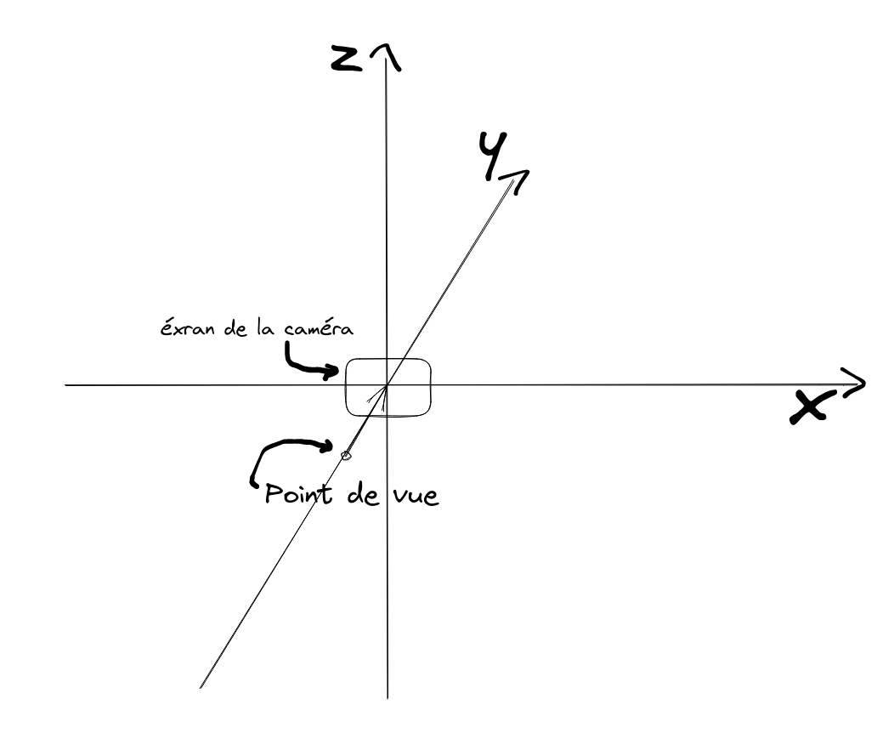
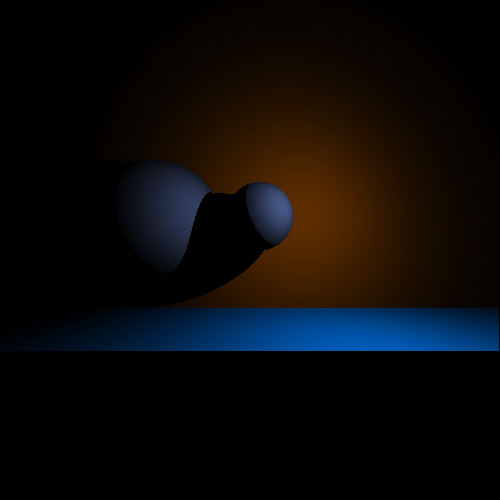

# RayTracer

Projet réalisé en 2ème année à EPITECH

membres du projet:
- [@Saverio976](https://github.com/Saverio976)
- [@bahmez](https://github.com/bahmez)
- [@SimonVermeulen](https://github.com/SimonVermeulen)
- [@Amaz31](https://github.com/Amaz31)

[Site Doxygen Du Projet](https://saverio976.github.io/Raytracer)
[UML du Projet](https://github.com/Saverio976/Raytracer/blob/gh-pages/uml.svg)

# Introduction

L'objectif est de réaliser un [Raytracer](https://fr.wikipedia.org/wiki/Ray_tracing) en [C++](https://fr.wikipedia.org/wiki/C%2B%2B)



<details>
    <summary>example 4K image and its config file ...</summary>


[config link](/scenes/4K/pyramide.yaax)

</details>

## TOC

- [Raytracer](#RayTracer)
- [Introduction](#Introduction)
- [TOC](#TOC)
- [Installation](#Installation)
- [Usage](#Usage)
- [Exemples/Documentation](#Exemples/Documentation)
- [Gource](#Gource)

# Installation

```bash
git clone https://github.com/Saverio976/Raytracer.git
cd Raytracer
cmake .
make
```
This will create a binary in the current working directory

# Usage

`./raytracer --help`
```bash
                                        ,----,
                                      ,/   .`|
,-.----.                            ,`   .'  :
\    /  \                         ;    ;     /
;   :    \                      .'___,/    ,' __  ,-.                                __  ,-.
|   | .\ :                      |    :     |,' ,'/ /|                              ,' ,'/ /|
.   : |: |   ,--.--.        .--,;    |.';  ;'  | |' | ,--.--.     ,---.     ,---.  '  | |' |
|   |  \ :  /       \     /_ ./|`----'  |  ||  |   ,'/       \   /     \   /     \ |  |   ,'
|   : .  / .--.  .-. | , ' , ' :    '   :  ;'  :  / .--.  .-. | /    / '  /    /  |'  :  /
;   | |  \  \__\/: . ./___/ \: |    |   |  '|  | '   \__\/: . ..    ' /  .    ' / ||  | '
|   | ;\  \ ," .--.; | .  \  ' |    '   :  |;  : |   ," .--.; |'   ; :__ '   ;   /|;  : |
:   ' | \.'/  /  ,.  |  \  ;   :    ;   |.' |  , ;  /  /  ,.  |'   | '.'|'   |  / ||  , ;
:   : :-' ;  :   .'   \  \  \  ;    '---'    ---'  ;  :   .'   \   :    :|   :    | ---'
|   |.'   |  ,     .-./   :  \  \                  |  ,     .-./\   \  /  \   \  /
`---'      `--`---'        \  ' ;                   `--`---'     `----'    `----'
                            `--`
__USAGE__:
	./raytracer --scene-path <scene-conf.yaax> --output-path <file> [--log-level <int>] [--gui] [--font-path <font file>]
	./raytracer --help

__OPTIONS__:
	--scene-path <scene-conf.yaax> path to scene config
	--output-path <file>           path to output file (dont put .ppm or any extension, it is just a base file path)
	--help                         to display the help message
	--log-level <int>              log level can be {-1: no log, 0: fatal, 1: error, 2: warn, 3: info, 4: debug, 5: trace} [3 by default]
	--gui                          to display the images in GUI mode
	--font-path <font file>        path to font file [./Assets/arial.ttf by default]

__IN WINDOW__:
	Z                              : go forward to exit
	Q                              : go left
	S                              : go backward to exit
	D                              : go right
	Space                          : go up
	Left Shift                     : go down
	Left Arrow                     : go previous camera
	Right Arrow                    : go next camera

__CREDITS__:
	Authors: Y A A X
	Repository: https://github.com/Saverio976/Raytracer
```

# Exemples/Documentation

les primitives sont:
- [Sphere](#Sphere)
- [Plan](#Plan)
- [Plan-Limité](#Plan-Limité)
- [Disque](#Disque)
- [Cone](#Cone)
- [Cone-Limité](#Cone-Limité)
- [Cylindre](#Cylindre)
- [Cylindre-Limité](#Cylindre-Limité)
- [Torus](#Torus)
- [Triangle](#Triangle)
- [Obj](#Obj)

les materiaux sont:
- [PlainMaterial](#PlainMaterial)
- [ChessBoardMaterial](#ChessBoardMaterial)
- [ZebraMaterial](#ZebraMaterial)
- [TransparencyMaterial](#TransparencyMaterial)
- [RefractionMaterial](#RefractionMaterial)
- [MirrorMaterial](#MirrorMaterial)

les lumières sont:
- [PointLight](#PointLight) (mais la documentation est sur toutes les primitives)
- [AmbientLight](#AmbientLight) (mais la documentation est sur toutes les primitives)
- [SpotLight](#SpotLight)

les cameras sont:
- [Camera](#Camera) (mais la documentation est sur toutes les primitives)
- [CameraCluster](#CameraCluster)

les filtres sont:
- [SSAAx4](#SSAAx4)

## Sphere


<details>
    <summary>aficher ...</summary>

```python
#sphere.yaax

# Configuration des cameras
cameras:
{
    # Camera par defaut (la plus simple d'utilisation)
    Camera: (
        {
            # Taille de l'image (de l'écran) (en pixels)
            size = {x: 500; y = 500;};
            transform = {
                # Position de l'écran
                position = {x = 0.0; y = 0.0; z = 0.0;};
                # L'Echelle n'est pas suportée
                scale = {x = 0.0; y = 0.0; z = 0.0;};
                # La rotation n'est pas suportée
                rotation = {x = 0.0; y = 0.0; z = 0.0;};
            };
            # Distance de la caméra par rapport à l'écran
            focal = 200.0;
            # Nombre de pixel d'éxécution en parallelle (-1 laisse la caméra sélectionner le maximum possible)
            maxThreads = -1;
            # Filtres (étape après la génération de l'image)
            filters = {};
        }
    );
};

# Les objets de la scene
primitives :
{
    # Liste des spheres
    Sphere = (
        # notre sphere est configuré ici
        {
            # Taille du rayon
            radius = 100.0;
            transform = {
                # Position de la sphere
                position = {x = -150.0; y = 150.0; z = 50.0;};
                # X: agrandis/diminus le rayon de la sphere
                # Y/Z: mettre 0.0
                scale = {x = 1.0; y = 0.0; z = 0.0;};
                # X/Y/Z: mettre 0.0 (à quoi ça sert de changer la rotation d'une sphere ?)
                rotation = {x = 0.0; y = 0.0; z = 0.0;};
            }
            material = {
                # Taux de reflet de la lumière
                shininess = 1.0;
                # Couleur de la sphere
                color = {r = 68.0; g = 171.0; b = 128.0; a = 255.0;};
                # Utilisation de la couche de la sphere
                type = "PlainMaterial";
                # Utilisé pour modifier le taux de reflet/couleur de la sphere (quand la lumière est ambiante)
                ambient = {x = 1.0; y = 1.0; z = 1.0};
                # Utilisé pour modifier le taux de reflet/couleur de la sphere (quand la lumière est une lampe)
                diffuse = {x = 1.0; y = 1.0; z = 1.0};
                # Utilisé pour modifier le taux de reflet/couleur de la sphere (quand la lumière est une lampe)
                specular = {x = 1.0; y = 1.0; z = 1.0};
            };
        },
    )
};

# Configuration de la lumière
lights :
{
    # Point de lumière (une lampe par example)
    PointLight = (
        # Première lampe de type PointLight
        {
            transform = {
                # Position de la lampe
                position = {x = 150.0; y = 0.0; z = 100.0;};
                # X: agrandis/diminus le rayon de la lampe
                # Y: agrandis/diminus la puissance de la lampe
                # Z: mettre 0.0
                scale = {x = 1.0; y = 1.0; z = 0.0;};
                # X/Y/Z: mettre 0.0 (à quoi ça sert de changer la rotation d'une lampe qui écair de tous les cotés?)
                rotation = {x = 0.0; y = 0.0; z = 0.0;};
            };
            # Couleur de la lampe
            color = {r = 255.0; g = 126.0; b = 300.0; a = 255.0;};
            # Puissance de la lampe (plus il est grand, plus il comptera par rapport aux autres lumières)
            power = 1.0;
            # Rayon du chants d'actions de la lumière (au-delà la lumière n'éclair pas)
            radius = 500.0;
        }
    );
    AmbientLight = (
        # Première lampe de type AmbientLight
        {
            transform = {
                # Position de la lampe
                position = {x = 150.0; y = 0.0; z = 100.0;};
                # X: agrandis/diminus la puissance de la lampe
                # Y/Z: mettre 0.0
                scale = {x = 1.0; y = 0.0; z = 0.0;};
                # X/Y/Z: mettre 0.0 (à quoi ça sert de changer la rotation d'une lampe qui écair partout?)
                rotation = {x = 0.0; y = 0.0; z = 0.0;};
            };
            # Couleur de la lampe
            color = {r = 50.0; g = 50.0; b = 50.0; a = 255.0;};
            # Puissance de la lampe (plus il est grand, plus il comptera par rapport aux autres lumières)
            power = 1.0;
        }
    );
};
```

</details>

## Plan


<details>
    <summary>aficher ...</summary>

```python
#plan.yaax

# Configuration des cameras
cameras:
{
    # Camera par defaut (la plus simple d'utilisation)
    Camera: (
        {
            # Taille de l'image (de l'écran) (en pixels)
            size = {x: 500; y = 500;};
            transform = {
                # Position de l'écran
                position = {x = 0.0; y = 0.0; z = 0.0;};
                # L'Echelle n'est pas suportée
                scale = {x = 0.0; y = 0.0; z = 0.0;};
                # La rotation n'est pas suportée
                rotation = {x = 0.0; y = 0.0; z = 0.0;};
            };
            # Distance de la caméra par rapport à l'écran
            focal = 200.0;
            # Nombre de pixel d'éxécution en parallelle (-1 laisse la caméra sélectionner le maximum possible)
            maxThreads = -1;
            # Filtres (étape après la génération de l'image)
            filters = {};
        }
    );
};

# Les objets de la scene
primitives :
{
    # Liste des plans
    Plane = (
        # Plan numéro 1
        {
            transform = {
                # Position du plan
                position = {x = 0.0; y = 150.0; z = 0.0;};
                # X/Y/Z: mettre 0.0 (à quoi ça sert d'agrandir un plan infini ?)
                scale = {x = 0.0; y = 0.0; z = 0.0;};
                # vecteur normalisé perpendiculaire au plan
                # cette config va faire un plan parallelle à la caméra
                rotation = {x = 0.0; y = 1.0; z = 0.0;};
            };
            material = {
                # Taux de reflet de la lumière
                shininess = 1.0;
                # Couleur du plan
                color = {r = 255.0; g = 255.0; b = 0.0; a = 255.0;};
                # Utilisation de la couche du plan
                type = "PlainMaterial";
                # Utilisé pour modifier le taux de reflet/couleur du plan (quand la lumière est ambiante)
                ambient = {x = 1.0; y = 1.0; z = 1.0};
                # Utilisé pour modifier le taux de reflet/couleur du plan (quand la lumière est une lampe)
                diffuse = {x = 1.0; y = 1.0; z = 1.0};
                # Utilisé pour modifier le taux de reflet/couleur du plan (quand la lumière est une lampe)
                specular = {x = 1.0; y = 1.0; z = 1.0};
            };
        },
        # Plan numéro 2
        {
            transform = {
                # Position du plan
                position = {x = 0.0; y = 10.0; z = -100.0;};
                # X/Y/Z: mettre 0.0 (à quoi ça sert d'agrandir un plan infini ?)
                scale = {x = 0.0; y = 0.0; z = 0.0;};
                # vecteur normalisé perpendiculaire au plan
                # cette config va faire un plan correspondant au sol
                rotation = {x = 0.0; y = 0.0; z = 1.0;};
            };
            material = {
                # Taux de reflet de la lumière
                shininess = 1.0;
                # Utilisé pour modifier le taux de reflet/couleur du plan (quand la lumière est ambiante)
                ambient = {x = 1.0; y = 1.0; z = 1.0};
                # Utilisé pour modifier le taux de reflet/couleur du plan (quand la lumière est une lampe)
                diffuse = {x = 1.0; y = 1.0; z = 1.0};
                # Utilisé pour modifier le taux de reflet/couleur du plan (quand la lumière est une lampe)
                specular = {x = 1.0; y = 1.0; z = 1.0};
                # Couleur du plan
                color = {r = 0.0; g = 255.0; b = 255.0; a = 255.0;};
                # Utilisation de la couche du plan
                type = "PlainMaterial";
            };
        }
    );
};

# Configuration de la lumière
lights :
{
    # Point de lumière (une lampe par example)
    PointLight = (
        # Première lampe de type PointLight
        {
            transform = {
                # Position de la lampe
                position = {x = 150.0; y = 0.0; z = 100.0;};
                # X: agrandis/diminus le rayon de la lampe
                # Y: agrandis/diminus la puissance de la lampe
                # Z: mettre 0.0
                scale = {x = 1.0; y = 1.0; z = 0.0;};
                # X/Y/Z: mettre 0.0 (à quoi ça sert de changer la rotation d'une lampe qui écair de tous les cotés?)
                rotation = {x = 0.0; y = 0.0; z = 0.0;};
            };
            # Couleur de la lampe
            color = {r = 255.0; g = 126.0; b = 300.0; a = 255.0;};
            # Puissance de la lampe (plus il est grand, plus il comptera par rapport aux autres lumières)
            power = 1.0;
            # Rayon du chants d'actions de la lumière (au-delà la lumière n'éclair pas)
            radius = 500.0;
        }
    );
    AmbientLight = (
        # Première lampe de type AmbientLight
        {
            transform = {
                # Position de la lampe
                position = {x = 150.0; y = 0.0; z = 100.0;};
                # X: agrandis/diminus la puissance de la lampe
                # Y/Z: mettre 0.0
                scale = {x = 1.0; y = 0.0; z = 0.0;};
                # X/Y/Z: mettre 0.0 (à quoi ça sert de changer la rotation d'une lampe qui écair partout?)
                rotation = {x = 0.0; y = 0.0; z = 0.0;};
            };
            # Couleur de la lampe
            color = {r = 50.0; g = 50.0; b = 50.0; a = 255.0;};
            # Puissance de la lampe (plus il est grand, plus il comptera par rapport aux autres lumières)
            power = 1.0;
        }
    );
};
```

</details>

# Plan-Limité


<details>
    <summary>aficher ...</summary>

```python
#plan-limited.yaax

# Configuration des cameras
cameras:
{
    # Camera par defaut (la plus simple d'utilisation)
    Camera: (
        {
            # Taille de l'image (de l'écran) (en pixels)
            size = {x: 500; y = 500;};
            transform = {
                # Position de l'écran
                position = {x = 0.0; y = 0.0; z = 0.0;};
                # L'Echelle n'est pas suportée
                scale = {x = 0.0; y = 0.0; z = 0.0;};
                # La rotation n'est pas suportée
                rotation = {x = 0.0; y = 0.0; z = 0.0;};
            };
            # Distance de la caméra par rapport à l'écran
            focal = 200.0;
            # Nombre de pixel d'éxécution en parallelle (-1 laisse la caméra sélectionner le maximum possible)
            maxThreads = -1;
            # Filtres (étape après la génération de l'image)
            filters = {};
        }
    );
};

# Les objets de la scene
primitives :
{
    # Liste des plans limité
    LimitedPlane = (
        # Plan numéro 1
        {
            transform = {
                # Position du plan
                position = {x = 0.0; y = 150.0; z = 0.0;};
                # X: agrandis/diminue la taille x
                # Y: agrandis/diminue la taille y
                # Z: mettre a 0
                scale = {x = 1.0; y = 1.0; z = 0.0;};
                # vecteur normalisé perpendiculaire au plan
                # cette config va faire un plan parallelle à la caméra
                rotation = {x = 0.0; y = 1.0; z = 0.0;};
            };
            # Taille du plan
            size = {x: 100; y = 200;};
            material = {
                # Taux de reflet de la lumière
                shininess = 1.0;
                # Couleur du plan
                color = {r = 255.0; g = 255.0; b = 0.0; a = 255.0;};
                # Utilisation de la couche du plan
                type = "PlainMaterial";
                # Utilisé pour modifier le taux de reflet/couleur du plan (quand la lumière est ambiante)
                ambient = {x = 1.0; y = 1.0; z = 1.0};
                # Utilisé pour modifier le taux de reflet/couleur du plan (quand la lumière est une lampe)
                diffuse = {x = 1.0; y = 1.0; z = 1.0};
                # Utilisé pour modifier le taux de reflet/couleur du plan (quand la lumière est une lampe)
                specular = {x = 1.0; y = 1.0; z = 1.0};
            };
        },
        # Plan numéro 2
        {
            transform = {
                # Position du plan
                position = {x = 0.0; y = 10.0; z = -100.0;};
                # X: agrandis/diminue la taille x
                # Y: agrandis/diminue la taille y
                # Z: mettre a 0
                scale = {x = 1.0; y = 1.0; z = 0.0;};
                # vecteur normalisé perpendiculaire au plan
                # cette config va faire un plan correspondant au sol
                rotation = {x = 0.0; y = 0.0; z = 1.0;};
            };
            # Taille du plan
            size = {x: 100; y = 100;};
            material = {
                # Taux de reflet de la lumière
                shininess = 1.0;
                # Utilisé pour modifier le taux de reflet/couleur du plan (quand la lumière est ambiante)
                ambient = {x = 1.0; y = 1.0; z = 1.0};
                # Utilisé pour modifier le taux de reflet/couleur du plan (quand la lumière est une lampe)
                diffuse = {x = 1.0; y = 1.0; z = 1.0};
                # Utilisé pour modifier le taux de reflet/couleur du plan (quand la lumière est une lampe)
                specular = {x = 1.0; y = 1.0; z = 1.0};
                # Couleur du plan
                color = {r = 0.0; g = 255.0; b = 255.0; a = 255.0;};
                # Utilisation de la couche du plan
                type = "PlainMaterial";
            };
        }
    );
};

# Configuration de la lumière
lights :
{
    # Point de lumière (une lampe par example)
    PointLight = (
        # Première lampe de type PointLight
        {
            transform = {
                # Position de la lampe
                position = {x = 150.0; y = 0.0; z = 100.0;};
                # X: agrandis/diminus le rayon de la lampe
                # Y: agrandis/diminus la puissance de la lampe
                # Z: mettre 0.0
                scale = {x = 1.0; y = 1.0; z = 0.0;};
                # X/Y/Z: mettre 0.0 (à quoi ça sert de changer la rotation d'une lampe qui écair de tous les cotés?)
                rotation = {x = 0.0; y = 0.0; z = 0.0;};
            };
            # Couleur de la lampe
            color = {r = 255.0; g = 126.0; b = 300.0; a = 255.0;};
            # Puissance de la lampe (plus il est grand, plus il comptera par rapport aux autres lumières)
            power = 1.0;
            # Rayon du chants d'actions de la lumière (au-delà la lumière n'éclair pas)
            radius = 500.0;
        }
    );
    AmbientLight = (
        # Première lampe de type AmbientLight
        {
            transform = {
                # Position de la lampe
                position = {x = 150.0; y = 0.0; z = 100.0;};
                # X: agrandis/diminus la puissance de la lampe
                # Y/Z: mettre 0.0
                scale = {x = 1.0; y = 0.0; z = 0.0;};
                # X/Y/Z: mettre 0.0 (à quoi ça sert de changer la rotation d'une lampe qui écair partout?)
                rotation = {x = 0.0; y = 0.0; z = 0.0;};
            };
            # Couleur de la lampe
            color = {r = 50.0; g = 50.0; b = 50.0; a = 255.0;};
            # Puissance de la lampe (plus il est grand, plus il comptera par rapport aux autres lumières)
            power = 1.0;
        }
    );
};
```

</details>

# Disque


<details>
    <summary>afficher ...</summary>

```python
#disk.yaax

# Configuration des cameras
cameras:
{
    # Camera par defaut (la plus simple d'utilisation)
    Camera: (
        {
            # Taille de l'image (de l'écran) (en pixels)
            size = {x: 500; y = 500;};
            transform = {
                # Position de l'écran
                position = {x = 0.0; y = 0.0; z = 0.0;};
                # L'Echelle n'est pas suportée
                scale = {x = 0.0; y = 0.0; z = 0.0;};
                # La rotation n'est pas suportée
                rotation = {x = 0.0; y = 0.0; z = 0.0;};
            };
            # Distance de la caméra par rapport à l'écran
            focal = 200.0;
            # Nombre de pixel d'éxécution en parallelle (-1 laisse la caméra sélectionner le maximum possible)
            maxThreads = -1;
            # Filtres (étape après la génération de l'image)
            filters = {};
        }
    );
};

# Les objets de la scene
primitives :
{
    # Liste des disk
    Disk: (
        # Disque numéro 1
        {
            # Taille du rayon
            radius = 100.0;
            transform = {
                # Position du disque
                position = {x = -150.0; y = 150.0; z = 50.0;};
                # X: agrandis/diminus le rayon du disque
                # Y/Z: mettre 0.0
                scale = {x = 1.0; y = 0.0; z = 0.0;};
                # vecteur normalisé perpendiculaire au disque
                # cette config va faire un disque parallelle à la caméra
                rotation = {x = 0.0; y = 1.0; z = 0.0;};
            }
            material = {
                # Taux de reflet de la lumière
                shininess = 1.0;
                # Couleur du disque
                color = {r = 255.0; g = 255.0; b = 0.0; a = 255.0;};
                # Utilisation de la couche du disque
                type = "PlainMaterial";
                # Utilisé pour modifier le taux de reflet/couleur du disque (quand la lumière est ambiante)
                ambient = {x = 1.0; y = 1.0; z = 1.0};
                # Utilisé pour modifier le taux de reflet/couleur du disque (quand la lumière est une lampe)
                diffuse = {x = 1.0; y = 1.0; z = 1.0};
                # Utilisé pour modifier le taux de reflet/couleur du disque (quand la lumière est une lampe)
                specular = {x = 1.0; y = 1.0; z = 1.0};
            }
        },
        # Disque numéro 2
        {
            # Taille du rayon
            radius = 100.0;
            transform = {
                # Position du disque
                position = {x = 15.0; y = 150.0; z = 50.0;};
                # X: agrandis/diminus le rayon du disque
                # Y/Z: mettre 0.0
                scale = {x = 1.0; y = 0.0; z = 0.0;};
                # vecteur normalisé perpendiculaire au disque
                # cette config va faire un truc que je sais pas expliqué, c.f. l'exemple ci-dessous
                rotation = {x = 1.0; y = 0.0; z = 0.0;};
            }
            material = {
                # Taux de reflet de la lumière
                shininess = 1.0;
                # Couleur du disque
                color = {r = 255.0; g = 255.0; b = 255.0; a = 255.0;};
                # Utilisation de la couche du disque
                type = "PlainMaterial";
                # Utilisé pour modifier le taux de reflet/couleur du disque (quand la lumière est ambiante)
                ambient = {x = 1.0; y = 1.0; z = 1.0};
                # Utilisé pour modifier le taux de reflet/couleur du disque (quand la lumière est une lampe)
                diffuse = {x = 1.0; y = 1.0; z = 1.0};
                # Utilisé pour modifier le taux de reflet/couleur du disque (quand la lumière est une lampe)
                specular = {x = 1.0; y = 1.0; z = 1.0};
            }
        }
    )
};

# Configuration de la lumière
lights :
{
    # Point de lumière (une lampe par example)
    PointLight = (
        # Première lampe de type PointLight
        {
            transform = {
                # Position de la lampe
                position = {x = 150.0; y = 0.0; z = 100.0;};
                # X: agrandis/diminus le rayon de la lampe
                # Y: agrandis/diminus la puissance de la lampe
                # Z: mettre 0.0
                scale = {x = 1.0; y = 1.0; z = 0.0;};
                # X/Y/Z: mettre 0.0 (à quoi ça sert de changer la rotation d'une lampe qui écair de tous les cotés?)
                rotation = {x = 0.0; y = 0.0; z = 0.0;};
            };
            # Couleur de la lampe
            color = {r = 255.0; g = 126.0; b = 300.0; a = 255.0;};
            # Puissance de la lampe (plus il est grand, plus il comptera par rapport aux autres lumières)
            power = 1.0;
            # Rayon du chants d'actions de la lumière (au-delà la lumière n'éclair pas)
            radius = 500.0;
        }
    );
    AmbientLight = (
        # Première lampe de type AmbientLight
        {
            transform = {
                # Position de la lampe
                position = {x = 150.0; y = 0.0; z = 100.0;};
                # X: agrandis/diminus la puissance de la lampe
                # Y/Z: mettre 0.0
                scale = {x = 1.0; y = 0.0; z = 0.0;};
                # X/Y/Z: mettre 0.0 (à quoi ça sert de changer la rotation d'une lampe qui écair partout?)
                rotation = {x = 0.0; y = 0.0; z = 0.0;};
            };
            # Couleur de la lampe
            color = {r = 50.0; g = 50.0; b = 50.0; a = 255.0;};
            # Puissance de la lampe (plus il est grand, plus il comptera par rapport aux autres lumières)
            power = 1.0;
        }
    );
};
```

</details>

# Cone


<details>
    <summary>afficher ...</summary>

```python
# cone.yaax

# Configuration des cameras
cameras:
{
    # Camera par defaut (la plus simple d'utilisation)
    Camera: (
        {
            # Taille de l'image (de l'écran) (en pixels)
            size = {x: 500; y = 500;};
            transform = {
                # Position de l'écran
                position = {x = 0.0; y = 0.0; z = 0.0;};
                # L'Echelle n'est pas suportée
                scale = {x = 0.0; y = 0.0; z = 0.0;};
                # La rotation n'est pas suportée
                rotation = {x = 0.0; y = 0.0; z = 0.0;};
            };
            # Distance de la caméra par rapport à l'écran
            focal = 200.0;
            # Nombre de pixel d'éxécution en parallelle (-1 laisse la caméra sélectionner le maximum possible)
            maxThreads = -1;
            # Filtres (étape après la génération de l'image)
            filters = {};
        }
    );
};

# Les objets de la scene
primitives :
{
    # Liste des cones
    Cone: (
        # Cone numéro 1
        {
            # Angle du cone
            angle = 1.0
            transform = {
                # Position du cone
                position = {x = 0.0; y = 200.0; z = 0.0;};
                # X: agrandis/diminus l'angle
                # Y/Z: mettre 0.0
                scale = {x = 1.0; y = 0.0; z = 0.0;};
                # vecteur qui va vers la direction du cone
                # ce cone regardera le ciel
                rotation = {x = 0.0; y = 0.0; z = 1.57};
            };
            material = {
                # Taux de reflet de la lumière
                shininess = 1.0;
                # Couleur du disque
                color = {r = 255.0; g = 255.0; b = 255.0; a = 255.0;};
                # Utilisation de la couche du disque
                type = "PlainMaterial";
                # Utilisé pour modifier le taux de reflet/couleur du disque (quand la lumière est ambiante)
                ambient = {x = 1.0; y = 1.0; z = 1.0};
                # Utilisé pour modifier le taux de reflet/couleur du disque (quand la lumière est une lampe)
                diffuse = {x = 1.0; y = 1.0; z = 1.0};
                # Utilisé pour modifier le taux de reflet/couleur du disque (quand la lumière est une lampe)
                specular = {x = 1.0; y = 1.0; z = 1.0};
            };
        }
    )
};

# Configuration de la lumière
lights :
{
    # Point de lumière (une lampe par example)
    PointLight = (
        # Première lampe de type PointLight
        {
            transform = {
                # Position de la lampe
                position = {x = 150.0; y = 0.0; z = 100.0;};
                # X: agrandis/diminus le rayon de la lampe
                # Y: agrandis/diminus la puissance de la lampe
                # Z: mettre 0.0
                scale = {x = 1.0; y = 1.0; z = 0.0;};
                # X/Y/Z: mettre 0.0 (à quoi ça sert de changer la rotation d'une lampe qui écair de tous les cotés?)
                rotation = {x = 0.0; y = 0.0; z = 0.0;};
            };
            # Couleur de la lampe
            color = {r = 255.0; g = 126.0; b = 300.0; a = 255.0;};
            # Puissance de la lampe (plus il est grand, plus il comptera par rapport aux autres lumières)
            power = 1.0;
            # Rayon du chants d'actions de la lumière (au-delà la lumière n'éclair pas)
            radius = 500.0;
        }
    );
    AmbientLight = (
        # Première lampe de type AmbientLight
        {
            transform = {
                # Position de la lampe
                position = {x = 150.0; y = 0.0; z = 100.0;};
                # X: agrandis/diminus la puissance de la lampe
                # Y/Z: mettre 0.0
                scale = {x = 1.0; y = 0.0; z = 0.0;};
                # X/Y/Z: mettre 0.0 (à quoi ça sert de changer la rotation d'une lampe qui écair partout?)
                rotation = {x = 0.0; y = 0.0; z = 0.0;};
            };
            # Couleur de la lampe
            color = {r = 50.0; g = 50.0; b = 50.0; a = 255.0;};
            # Puissance de la lampe (plus il est grand, plus il comptera par rapport aux autres lumières)
            power = 1.0;
        }
    );
};
```

</details>

# Cone-Limité


<details>
    <summary>afficher ...</summary>

```python
# cone-limited.yaax

# Configuration des cameras
cameras:
{
    # Camera par defaut (la plus simple d'utilisation)
    Camera: (
        {
            # Taille de l'image (de l'écran) (en pixels)
            size = {x: 500; y = 500;};
            transform = {
                # Position de l'écran
                position = {x = 0.0; y = 0.0; z = 0.0;};
                # L'Echelle n'est pas suportée
                scale = {x = 0.0; y = 0.0; z = 0.0;};
                # La rotation n'est pas suportée
                rotation = {x = 0.0; y = 0.0; z = 0.0;};
            };
            # Distance de la caméra par rapport à l'écran
            focal = 200.0;
            # Nombre de pixel d'éxécution en parallelle (-1 laisse la caméra sélectionner le maximum possible)
            maxThreads = -1;
            # Filtres (étape après la génération de l'image)
            filters = {};
        }
    );
};

# Les objets de la scene
primitives :
{
    # Liste des cones
    LimitedCone: (
        # Cone numéro 1
        {
            # Angle du cone
            angle = 1.0;
            # Taille du cone
            height = 200.0;
            transform = {
                # Position du cone
                position = {x = 0.0; y = 200.0; z = 0.0;};
                # X: agrandis/diminus l'angle
                # Y: agrandis/diminus la taille
                # Z: mettre 0.0
                scale = {x = 1.0; y = 0.0; z = 0.0;};
                # vecteur qui va vers la direction du cone
                # ce cone regardera le ciel
                rotation = {x = 0.0; y = 0.0; z = 1.57};
            };
            material = {
                # Taux de reflet de la lumière
                shininess = 1.0;
                # Couleur du disque
                color = {r = 255.0; g = 255.0; b = 255.0; a = 255.0;};
                # Utilisation de la couche du disque
                type = "PlainMaterial";
                # Utilisé pour modifier le taux de reflet/couleur du disque (quand la lumière est ambiante)
                ambient = {x = 1.0; y = 1.0; z = 1.0};
                # Utilisé pour modifier le taux de reflet/couleur du disque (quand la lumière est une lampe)
                diffuse = {x = 1.0; y = 1.0; z = 1.0};
                # Utilisé pour modifier le taux de reflet/couleur du disque (quand la lumière est une lampe)
                specular = {x = 1.0; y = 1.0; z = 1.0};
            };
        }
    )
};

# Configuration de la lumière
lights :
{
    # Point de lumière (une lampe par example)
    PointLight = (
        # Première lampe de type PointLight
        {
            transform = {
                # Position de la lampe
                position = {x = 150.0; y = 0.0; z = 100.0;};
                # X: agrandis/diminus le rayon de la lampe
                # Y: agrandis/diminus la puissance de la lampe
                # Z: mettre 0.0
                scale = {x = 1.0; y = 1.0; z = 0.0;};
                # X/Y/Z: mettre 0.0 (à quoi ça sert de changer la rotation d'une lampe qui écair de tous les cotés?)
                rotation = {x = 0.0; y = 0.0; z = 0.0;};
            };
            # Couleur de la lampe
            color = {r = 255.0; g = 126.0; b = 300.0; a = 255.0;};
            # Puissance de la lampe (plus il est grand, plus il comptera par rapport aux autres lumières)
            power = 1.0;
            # Rayon du chants d'actions de la lumière (au-delà la lumière n'éclair pas)
            radius = 500.0;
        }
    );
    AmbientLight = (
        # Première lampe de type AmbientLight
        {
            transform = {
                # Position de la lampe
                position = {x = 150.0; y = 0.0; z = 100.0;};
                # X: agrandis/diminus la puissance de la lampe
                # Y/Z: mettre 0.0
                scale = {x = 1.0; y = 0.0; z = 0.0;};
                # X/Y/Z: mettre 0.0 (à quoi ça sert de changer la rotation d'une lampe qui écair partout?)
                rotation = {x = 0.0; y = 0.0; z = 0.0;};
            };
            # Couleur de la lampe
            color = {r = 50.0; g = 50.0; b = 50.0; a = 255.0;};
            # Puissance de la lampe (plus il est grand, plus il comptera par rapport aux autres lumières)
            power = 1.0;
        }
    );
};
```

</details>

# Cylindre


<details>
    <summary>afficher ...</summary>

```python
# cylinder.yaax

# Configuration des cameras
cameras:
{
    # Camera par defaut (la plus simple d'utilisation)
    Camera: (
        {
            # Taille de l'image (de l'écran) (en pixels)
            size = {x: 500; y = 500;};
            transform = {
                # Position de l'écran
                position = {x = 0.0; y = 0.0; z = 0.0;};
                # L'Echelle n'est pas suportée
                scale = {x = 0.0; y = 0.0; z = 0.0;};
                # La rotation n'est pas suportée
                rotation = {x = 0.0; y = 0.0; z = 0.0;};
            };
            # Distance de la caméra par rapport à l'écran
            focal = 200.0;
            # Nombre de pixel d'éxécution en parallelle (-1 laisse la caméra sélectionner le maximum possible)
            maxThreads = -1;
            # Filtres (étape après la génération de l'image)
            filters = {};
        }
    );
};

# Les objets de la scene
primitives :
{
    # Liste des cylindres
    Cylinder = (
        # Cylindre numero 1
        {
            transform = {
                # Position du cylindre
                position = {x = 100.0; y = 0.0; z = -100.0;};
                # X: agrandis/diminus le rayon du cylindre
                # Y/Z: mettre 0.0
                scale = {x = 1.0; y = 0.0; z = 0.0;};
                # X/Y/Z: mettre 0.0 (La roation n'est pas supportée)
                rotation = {x = 0.0; y = 0.0; z = 0.0;};
            }
            # Rayon du cylindre
            radius = 50.0;
            material = {
                # Taux de reflet de la lumière
                shininess = 1.0;
                # Utilisé pour modifier le taux de reflet/couleur de la sphere (quand la lumière est ambiante)
                ambient = {x = 1.0; y = 1.0; z = 1.0};
                # Utilisé pour modifier le taux de reflet/couleur de la sphere (quand la lumière est une lampe)
                diffuse = {x = 1.0; y = 1.0; z = 1.0};
                # Utilisé pour modifier le taux de reflet/couleur de la sphere (quand la lumière est une lampe)
                specular = {x = 1.0; y = 1.0; z = 1.0};
                # Couleur du cylindre
                color = {r = 0.0; g = 255.0; b = 255.0; a = 255.0;};
                # Utilisation du matériau
                type = "PlainMaterial";
            }
        }
    )
};

# Configuration de la lumière
lights :
{
    # Point de lumière (une lampe par example)
    PointLight = (
        # Première lampe de type PointLight
        {
            transform = {
                # Position de la lampe
                position = {x = 150.0; y = 0.0; z = 100.0;};
                # X: agrandis/diminus le rayon de la lampe
                # Y: agrandis/diminus la puissance de la lampe
                # Z: mettre 0.0
                scale = {x = 1.0; y = 0.0; z = 0.0;};
                # X/Y/Z: mettre 0.0 (à quoi ça sert de changer la rotation d'une lampe qui écair de tous les cotés?)
                rotation = {x = 0.0; y = 0.0; z = 0.0;};
            };
            # Couleur de la lampe
            color = {r = 255.0; g = 126.0; b = 300.0; a = 255.0;};
            # Puissance de la lampe (plus il est grand, plus il comptera par rapport aux autres lumières)
            power = 1.0;
            # Rayon du chants d'actions de la lumière (au-delà la lumière n'éclair pas)
            radius = 500.0;
        }
    );
    AmbientLight = (
        # Première lampe de type AmbientLight
        {
            transform = {
                # Position de la lampe
                position = {x = 150.0; y = 0.0; z = 100.0;};
                # X: agrandis/diminus la puissance de la lampe
                # Y/Z: mettre 0.0
                scale = {x = 1.0; y = 0.0; z = 0.0;};
                # X/Y/Z: mettre 0.0 (à quoi ça sert de changer la rotation d'une lampe qui écair partout?)
                rotation = {x = 0.0; y = 0.0; z = 0.0;};
            };
            # Couleur de la lampe
            color = {r = 50.0; g = 50.0; b = 50.0; a = 255.0;};
            # Puissance de la lampe (plus il est grand, plus il comptera par rapport aux autres lumières)
            power = 1.0;
        }
    );
};
```

</details>

# Cylindre-Limité


<details>
    <summary>afficher ...</summary>

```python
# cylinder-limited.yaax

# Configuration des cameras
cameras:
{
    # Camera par defaut (la plus simple d'utilisation)
    Camera: (
        {
            # Taille de l'image (de l'écran) (en pixels)
            size = {x: 500; y = 500;};
            transform = {
                # Position de l'écran
                position = {x = 0.0; y = 0.0; z = 0.0;};
                # L'Echelle n'est pas suportée
                scale = {x = 0.0; y = 0.0; z = 0.0;};
                # La rotation n'est pas suportée
                rotation = {x = 0.0; y = 0.0; z = 0.0;};
            };
            # Distance de la caméra par rapport à l'écran
            focal = 200.0;
            # Nombre de pixel d'éxécution en parallelle (-1 laisse la caméra sélectionner le maximum possible)
            maxThreads = -1;
            # Filtres (étape après la génération de l'image)
            filters = {};
        }
    );
};

# Les objets de la scene
primitives :
{
    # Liste des cylindres
    LimitedCylinder = (
        # Cylindre numero 1
        {
            transform = {
                # Position du cylindre
                position = {x = 100.0; y = 0.0; z = -100.0;};
                # X: agrandis/diminus le rayon du cylindre
                # Y: agrandis/diminus la taille du cylindre
                # Z: mettre 0.0
                scale = {x = 1.0; y = 1.0; z = 0.0;};
                # X/Y/Z: mettre 0.0 (La roation n'est pas supportée)
                rotation = {x = 0.0; y = 0.0; z = 0.0;};
            }
            # Rayon du cylindre
            radius = 50.0;
            # Taille du cylindre
            height = 60.0;
            material = {
                # Taux de reflet de la lumière
                shininess = 1.0;
                # Utilisé pour modifier le taux de reflet/couleur de la sphere (quand la lumière est ambiante)
                ambient = {x = 1.0; y = 1.0; z = 1.0};
                # Utilisé pour modifier le taux de reflet/couleur de la sphere (quand la lumière est une lampe)
                diffuse = {x = 1.0; y = 1.0; z = 1.0};
                # Utilisé pour modifier le taux de reflet/couleur de la sphere (quand la lumière est une lampe)
                specular = {x = 1.0; y = 1.0; z = 1.0};
                # Couleur du cylindre
                color = {r = 255.0; g = 255.0; b = 255.0; a = 255.0;};
                # Utilisation du matériau
                type = "PlainMaterial";
            }
        }
    )
};

# Configuration de la lumière
lights :
{
    # Point de lumière (une lampe par example)
    PointLight = (
        # Première lampe de type PointLight
        {
            transform = {
                # Position de la lampe
                position = {x = 150.0; y = 0.0; z = 100.0;};
                # X: agrandis/diminus le rayon de la lampe
                # Y: agrandis/diminus la puissance de la lampe
                # Z: mettre 0.0
                scale = {x = 1.0; y = 1.0; z = 0.0;};
                # X/Y/Z: mettre 0.0 (à quoi ça sert de changer la rotation d'une lampe qui écair de tous les cotés?)
                rotation = {x = 0.0; y = 0.0; z = 0.0;};
            };
            # Couleur de la lampe
            color = {r = 255.0; g = 126.0; b = 300.0; a = 255.0;};
            # Puissance de la lampe (plus il est grand, plus il comptera par rapport aux autres lumières)
            power = 1.0;
            # Rayon du chants d'actions de la lumière (au-delà la lumière n'éclair pas)
            radius = 500.0;
        }
    );
    AmbientLight = (
        # Première lampe de type AmbientLight
        {
            transform = {
                # Position de la lampe
                position = {x = 150.0; y = 0.0; z = 100.0;};
                # X: agrandis/diminus la puissance de la lampe
                # Y/Z: mettre 0.0
                scale = {x = 1.0; y = 0.0; z = 0.0;};
                # X/Y/Z: mettre 0.0 (à quoi ça sert de changer la rotation d'une lampe qui écair partout?)
                rotation = {x = 0.0; y = 0.0; z = 0.0;};
            };
            # Couleur de la lampe
            color = {r = 50.0; g = 50.0; b = 50.0; a = 255.0;};
            # Puissance de la lampe (plus il est grand, plus il comptera par rapport aux autres lumières)
            power = 1.0;
        }
    );
};
```

</details>

## Torus


<details>
	<summary>afficher ...</summary>

```python
# torus.yaax

# configuration des cameras
cameras:
{
    # camera par defaut (la plus simple d'utilisation)
    Camera: (
        {
            # taille de l'image (de l'écran) (en pixels)
            size = {x: 500; y = 500;};
            transform = {
                # position de l'écran
                position = {x = 0.0; y = 0.0; z = 0.0;};
                # l'echelle n'est pas suportée
                scale = {x = 0.0; y = 0.0; z = 0.0;};
                # la rotation n'est pas suportée
                rotation = {x = 0.0; y = 0.0; z = 0.0;};
            };
            # distance de la caméra par rapport à l'écran
            focal = 200.0;
            # nombre de pixel d'éxécution en parallelle (-1 laisse la caméra sélectionner le maximum possible)
            maxThreads = -1;
            # filtres (étape après la génération de l'image)
            filters = {};
        }
    );
};

# les objets de la scene
primitives :
{
    # list of torus
    Torus = (
        {
            minRadius = 50.0;
            maxRadius = 120.0;
            transform = {
                # position du torus
                position = {x = 0.0; y = 30.0; z = 0.0;};
                # x: agrandis/diminus l'angle maxradius
                # y: agrandis/diminus l'angle minradius
                # z: mettre 0.0
                scale = {x = 1.0; y = 1.0; z = 0.0;};
                # x/y/z: mettre 0.0 (la rotation n'est pas suportée)
                rotation = {x = 0.0; y = 0.0; z = 0.0;};
            };
            material = {
                # utilisation du matériau
                type = "PlainMaterial";
                # taux de reflet de la lumière
                shininess = 1.0;
                # utilisé pour modifier le taux de reflet/couleur de la sphere (lumière ambiante)
                ambient = {x = 1.0; y = 1.0; z = 1.0;};
                # utilisé pour modifier le taux de reflet/couleur de la sphere (lumière lampe)
                diffuse = {x = 1.0; y = 1.0; z = 1.0;};
                # utilisé pour modifier le taux de reflet/couleur de la sphere (lumière lampe)
                specular = {x = 1.0; y = 1.0; z = 1.0;};
                # couleur du torus
                color = {r = 50.0; g = 255.0; b = 255.0; a = 255.0;};
            };
        }
    );
};

# configuration de la lumière
lights :
{
    # point de lumière (une lampe par example)
    PointLight = (
        # première lampe de type pointlight
        {
            transform = {
                # position de la lampe
                position = {x = 150.0; y = 0.0; z = 100.0;};
                # x: agrandis/diminus le rayon de la lampe
                # y: agrandis/diminus la puissance de la lampe
                # z: mettre 0.0
                scale = {x = 1.0; y = 1.0; z = 0.0;};
                # x/y/z: mettre 0.0 (à quoi ça sert de changer la rotation d'une lampe qui écair de tous les cotés?)
                rotation = {x = 0.0; y = 0.0; z = 0.0;};
            };
            # couleur de la lampe
            color = {r = 255.0; g = 126.0; b = 300.0; a = 255.0;};
            # puissance de la lampe (plus il est grand, plus il comptera par rapport aux autres lumières)
            power = 1.0;
            # rayon du chants d'actions de la lumière (au-delà la lumière n'éclair pas)
            radius = 500.0;
        }
    );
    AmbientLight = (
        # première lampe de type ambientlight
        {
            transform = {
                # position de la lampe
                position = {x = 150.0; y = 0.0; z = 100.0;};
                # x: agrandis/diminus la puissance de la lampe
                # y/z: mettre 0.0
                scale = {x = 1.0; y = 0.0; z = 0.0;};
                # x/y/z: mettre 0.0 (à quoi ça sert de changer la rotation d'une lampe qui écair partout?)
                rotation = {x = 0.0; y = 0.0; z = 0.0;};
            };
            # couleur de la lampe
            color = {r = 50.0; g = 50.0; b = 50.0; a = 255.0;};
            # puissance de la lampe (plus il est grand, plus il comptera par rapport aux autres lumières)
            power = 1.0;
        }
    );
};
```

</details>

## Triangle


<details>
	<summary>afficher ...</summary>

```python
# triangle.yaax

# configuration des cameras
cameras:
{
    # camera par defaut (la plus simple d'utilisation)
    Camera: (
        {
            # taille de l'image (de l'écran) (en pixels)
            size = {x: 500; y = 500;};
            transform = {
                # position de l'écran
                position = {x = 0.0; y = 0.0; z = 0.0;};
                # l'echelle n'est pas suportée
                scale = {x = 0.0; y = 0.0; z = 0.0;};
                # la rotation n'est pas suportée
                rotation = {x = 0.0; y = 0.0; z = 0.0;};
            };
            # distance de la caméra par rapport à l'écran
            focal = 200.0;
            # nombre de pixel d'éxécution en parallelle (-1 laisse la caméra sélectionner le maximum possible)
            maxthreads = -1;
            # filtres (étape après la génération de l'image)
            filters = {};
        }
    );
};

# les objets de la scene
primitives :
{
    # list of triangle
    Triangle = (
        {
            # Premier point du triangle
            pointOne = {x = 0.0; y = 100.0; z = 200.0;};
            # Second point du triangle
            pointTwo = {x = 40.0; y = 100.0; z = 0.0;};
            # Troisième point du triangle
            pointThree = {x = -40.0; y = 100.0; z = 0.0;};
            transform = {
                # X/Y/Z: mettre 0.0
                position = {x = 0.0; y = 0.0; z = 20.0;};
                # X/Y/Z: mettre 0.0
                scale = {x = 0.0; y = 0.0; z = 0.0;};
                # X/Y/Z: mettre 0.0
                rotation = {x = 0.0; y = 0.0; z = 0.0;};
            };
            material = {
                # Utilisation du matériau
                type = "PlainMaterial";
                # taux de reflet de la lumière
                shininess = 1.0;
                # utilisé pour modifier le taux de reflet/couleur de la sphere (lumière ambiante)
                ambient = {x = 1.0; y = 1.0; z = 1.0;};
                # utilisé pour modifier le taux de reflet/couleur de la sphere (lumière lampe)
                diffuse = {x = 1.0; y = 1.0; z = 1.0;};
                # utilisé pour modifier le taux de reflet/couleur de la sphere (lumière lampe)
                specular = {x = 1.0; y = 1.0; z = 1.0;};
                # Couleur du triangle
                color = {r = 0.0; g = 255.0; b = 255.0; a = 255.0;};
            };
        }
    );
};

# configuration de la lumière
lights :
{
    # point de lumière (une lampe par example)
    PointLight = (
        # première lampe de type pointlight
        {
            transform = {
                # position de la lampe
                position = {x = 150.0; y = 0.0; z = 100.0;};
                # x: agrandis/diminus le rayon de la lampe
                # y: agrandis/diminus la puissance de la lampe
                # z: mettre 0.0
                scale = {x = 1.0; y = 1.0; z = 0.0;};
                # x/y/z: mettre 0.0 (à quoi ça sert de changer la rotation d'une lampe qui écair de tous les cotés?)
                rotation = {x = 0.0; y = 0.0; z = 0.0;};
            };
            # couleur de la lampe
            color = {r = 255.0; g = 126.0; b = 300.0; a = 255.0;};
            # puissance de la lampe (plus il est grand, plus il comptera par rapport aux autres lumières)
            power = 1.0;
            # rayon du chants d'actions de la lumière (au-delà la lumière n'éclair pas)
            radius = 500.0;
        }
    );
    AmbientLight = (
        # première lampe de type ambientlight
        {
            transform = {
                # position de la lampe
                position = {x = 150.0; y = 0.0; z = 100.0;};
                # x: agrandis/diminus la puissance de la lampe
                # y/z: mettre 0.0
                scale = {x = 1.0; y = 0.0; z = 0.0;};
                # x/y/z: mettre 0.0 (à quoi ça sert de changer la rotation d'une lampe qui écair partout?)
                rotation = {x = 0.0; y = 0.0; z = 0.0;};
            };
            # couleur de la lampe
            color = {r = 50.0; g = 50.0; b = 50.0; a = 255.0;};
            # puissance de la lampe (plus il est grand, plus il comptera par rapport aux autres lumières)
            power = 1.0;
        }
    );
};
```

</details>

## Obj


<details>*
	<summary>afficher ...</summary>

```python
# obj.yaax

# Configuration of the camera
cameras:
{
    Camera: (
        {
            size = {x: 500; y = 500;};
            transform = {
                position = {x = 0.0; y = -30.0; z = 0.0;};
                scale = {x = 0.0; y = 0.0; z = 0.0;};
                rotation = {x = 0.0; y = 0.0; z = 0.0;};
            };
            focal = 200.0;
            maxThreads = -1;
            filters = {
                SSAAx4: (
                    {
                        maxThreads = -1;
                    }
                )
            }
        }
    );
};

# Primitives in the scene
primitives :
{
    # List of OBJ
    Obj = (
        {
            filePath = "./tests/obj/monkey.obj";
            transform = {
                position = {x = 0.0; y = 0.0; z = 0.0;};
                scale = {x = 1.0; y = 1.0; z = 1.0;};
                rotation = {x = 0.0; y = 0.0; z = 0.0;};
            }
            material = {
                type = "PlainMaterial";
                shininess = 10.0;
                ambient = {x = 1.0; y = 1.0; z = 1.0;};
                diffuse = {x = 1.0; y = 1.0; z = 1.0;};
                specular = {x = 1.0; y = 1.0; z = 1.0;};
                color = {r = 68.0; g = 171.0; b = 128.0; a = 255.0;};
            };
        }
    );
};

# Light configuration
lights :
{
    PointLight = (
        {
            transform = {
                position = {x = 0.0; y = -10.0; z = 0.0;};
                scale = {x = 500.0; y = 1.0; z = 0.0;};
                rotation = {x = 60.0; y = 20.0; z = -10.0;};
            };
            color = {r = 255.0; g = 126.0; b = 255.0; a = 255.0;};
            power = 2.0;
            radius = 500.0;
        }
    );
    AmbientLight = (
        {
            transform = {
                position = {x = 150.0; y = 0.0; z = 100.0;};
                scale = {x = 1.0; y = 0.0; z = 0.0;};
                rotation = {x = 60.0; y = 20.0; z = -10.0;};
            };
            color = {r = 50.0; g = 50.0; b = 50.0; a = 255.0;};
            power = 1.0;
        }
    );
};
```

</details>

## PlainMaterial


<details>
	<summary>afficher ...</summary>

```python
# plainmaterial.yaax

# Configuration des cameras
cameras:
{
    # Camera par defaut (la plus simple d'utilisation)
    Camera: (
        {
            # Taille de l'image (de l'écran) (en pixels)
            size = {x: 500; y = 500;};
            transform = {
                # Position de l'écran
                position = {x = 0.0; y = 0.0; z = 0.0;};
                # L'Echelle n'est pas suportée
                scale = {x = 0.0; y = 0.0; z = 0.0;};
                # La rotation n'est pas suportée
                rotation = {x = 0.0; y = 0.0; z = 0.0;};
            };
            # Distance de la caméra par rapport à l'écran
            focal = 200.0;
            # Nombre de pixel d'éxécution en parallelle (-1 laisse la caméra sélectionner le maximum possible)
            maxThreads = -1;
            # Filtres (étape après la génération de l'image)
            filters = {};
        }
    );
};

# Les objets de la scene
primitives :
{
    # Liste des spheres
    Sphere = (
        # notre sphere est configuré ici
        {
            # Taille du rayon
            radius = 100.0;
            transform = {
                # Position de la sphere
                position = {x = -150.0; y = 150.0; z = 50.0;};
                # X: agrandis/diminus le rayon de la sphere
                # Y/Z: mettre 0.0
                scale = {x = 1.0; y = 0.0; z = 0.0;};
                # X/Y/Z: mettre 0.0 (à quoi ça sert de changer la rotation d'une sphere ?)
                rotation = {x = 0.0; y = 0.0; z = 0.0;};
            }
            material = {
                # Taux de reflet de la lumière
                shininess = 1.0;
                # Couleur de la sphere
                color = {r = 68.0; g = 171.0; b = 128.0; a = 255.0;};
                # Utilisation de la couche de la sphere
                type = "PlainMaterial";
                # Utilisé pour modifier le taux de reflet/couleur de la sphere (quand la lumière est ambiante)
                ambient = {x = 1.0; y = 1.0; z = 1.0};
                # Utilisé pour modifier le taux de reflet/couleur de la sphere (quand la lumière est une lampe)
                diffuse = {x = 1.0; y = 1.0; z = 1.0};
                # Utilisé pour modifier le taux de reflet/couleur de la sphere (quand la lumière est une lampe)
                specular = {x = 1.0; y = 1.0; z = 1.0};
            };
        },
    )
};

# Configuration de la lumière
lights :
{
    # Point de lumière (une lampe par example)
    PointLight = (
        # Première lampe de type PointLight
        {
            transform = {
                # Position de la lampe
                position = {x = 150.0; y = 0.0; z = 100.0;};
                # X: agrandis/diminus le rayon de la lampe
                # Y: agrandis/diminus la puissance de la lampe
                # Z: mettre 0.0
                scale = {x = 1.0; y = 1.0; z = 0.0;};
                # X/Y/Z: mettre 0.0 (à quoi ça sert de changer la rotation d'une lampe qui écair de tous les cotés?)
                rotation = {x = 0.0; y = 0.0; z = 0.0;};
            };
            # Couleur de la lampe
            color = {r = 255.0; g = 126.0; b = 300.0; a = 255.0;};
            # Puissance de la lampe (plus il est grand, plus il comptera par rapport aux autres lumières)
            power = 1.0;
            # Rayon du chants d'actions de la lumière (au-delà la lumière n'éclair pas)
            radius = 500.0;
        }
    );
    AmbientLight = (
        # Première lampe de type AmbientLight
        {
            transform = {
                # Position de la lampe
                position = {x = 150.0; y = 0.0; z = 100.0;};
                # X: agrandis/diminus la puissance de la lampe
                # Y/Z: mettre 0.0
                scale = {x = 1.0; y = 0.0; z = 0.0;};
                # X/Y/Z: mettre 0.0 (à quoi ça sert de changer la rotation d'une lampe qui écair partout?)
                rotation = {x = 0.0; y = 0.0; z = 0.0;};
            };
            # Couleur de la lampe
            color = {r = 50.0; g = 50.0; b = 50.0; a = 255.0;};
            # Puissance de la lampe (plus il est grand, plus il comptera par rapport aux autres lumières)
            power = 1.0;
        }
    );
};
```

</details>

## ChessBoardMaterial


<details>
	<summary>afficher ...</summary>

```python
# chessboardmaterial.yaax

# Configuration des cameras
cameras:
{
    # Camera par defaut (la plus simple d'utilisation)
    Camera: (
        {
            # Taille de l'image (de l'écran) (en pixels)
            size = {x: 500; y = 500;};
            transform = {
                # Position de l'écran
                position = {x = 0.0; y = 0.0; z = 0.0;};
                # L'Echelle n'est pas suportée
                scale = {x = 0.0; y = 0.0; z = 0.0;};
                # La rotation n'est pas suportée
                rotation = {x = 0.0; y = 0.0; z = 0.0;};
            };
            # Distance de la caméra par rapport à l'écran
            focal = 200.0;
            # Nombre de pixel d'éxécution en parallelle (-1 laisse la caméra sélectionner le maximum possible)
            maxThreads = -1;
            # Filtres (étape après la génération de l'image)
            filters = {};
        }
    );
};

# Les objets de la scene
primitives :
{
    # Liste des spheres
    Sphere = (
        # notre sphere est configuré ici
        {
            # Taille du rayon
            radius = 100.0;
            transform = {
                # Position de la sphere
                position = {x = -150.0; y = 150.0; z = 50.0;};
                # X: agrandis/diminus le rayon de la sphere
                # Y/Z: mettre 0.0
                scale = {x = 1.0; y = 0.0; z = 0.0;};
                # X/Y/Z: mettre 0.0 (à quoi ça sert de changer la rotation d'une sphere ?)
                rotation = {x = 0.0; y = 0.0; z = 0.0;};
            }
            material = {
                # Utilisation de la couche de la sphere
                type = "ChessBoardMaterial";
                # taille des cases
                size = 10.0;
                # Couleur des cases impairs
                impair = {r = 255.0; g = 255.0; b = 255.0; a = 255.0;};
                # Couleur des cases pairs
                pair = {r = 0.0; g = 0.0; b = 0.0; a = 255.0;};
                # Taux de reflet de la lumière
                shininess = 1.0;
                # Utilisé pour modifier le taux de reflet/couleur de la sphere (quand la lumière est ambiante)
                ambient = {x = 1.0; y = 1.0; z = 1.0};
                # Utilisé pour modifier le taux de reflet/couleur de la sphere (quand la lumière est une lampe)
                diffuse = {x = 1.0; y = 1.0; z = 1.0};
                # Utilisé pour modifier le taux de reflet/couleur de la sphere (quand la lumière est une lampe)
                specular = {x = 1.0; y = 1.0; z = 1.0};
            };
        },
    )
};

# Configuration de la lumière
lights :
{
    # Point de lumière (une lampe par example)
    PointLight = (
        # Première lampe de type PointLight
        {
            transform = {
                # Position de la lampe
                position = {x = 150.0; y = 0.0; z = 100.0;};
                # X: agrandis/diminus le rayon de la lampe
                # Y: agrandis/diminus la puissance de la lampe
                # Z: mettre 0.0
                scale = {x = 1.0; y = 1.0; z = 0.0;};
                # X/Y/Z: mettre 0.0 (à quoi ça sert de changer la rotation d'une lampe qui écair de tous les cotés?)
                rotation = {x = 0.0; y = 0.0; z = 0.0;};
            };
            # Couleur de la lampe
            color = {r = 255.0; g = 126.0; b = 300.0; a = 255.0;};
            # Puissance de la lampe (plus il est grand, plus il comptera par rapport aux autres lumières)
            power = 1.0;
            # Rayon du chants d'actions de la lumière (au-delà la lumière n'éclair pas)
            radius = 500.0;
        }
    );
    AmbientLight = (
        # Première lampe de type AmbientLight
        {
            transform = {
                # Position de la lampe
                position = {x = 150.0; y = 0.0; z = 100.0;};
                # X: agrandis/diminus la puissance de la lampe
                # Y/Z: mettre 0.0
                scale = {x = 1.0; y = 0.0; z = 0.0;};
                # X/Y/Z: mettre 0.0 (à quoi ça sert de changer la rotation d'une lampe qui écair partout?)
                rotation = {x = 0.0; y = 0.0; z = 0.0;};
            };
            # Couleur de la lampe
            color = {r = 50.0; g = 50.0; b = 50.0; a = 255.0;};
            # Puissance de la lampe (plus il est grand, plus il comptera par rapport aux autres lumières)
            power = 1.0;
        }
    );
};
```

</details>

## ZebraMaterial


<details>
	<summary>afficher ...</summary>

```python
# zebramaterial.yaax

# Configuration des cameras
cameras:
{
    # Camera par defaut (la plus simple d'utilisation)
    Camera: (
        {
            # Taille de l'image (de l'écran) (en pixels)
            size = {x: 500; y = 500;};
            transform = {
                # Position de l'écran
                position = {x = 0.0; y = 0.0; z = 0.0;};
                # L'Echelle n'est pas suportée
                scale = {x = 0.0; y = 0.0; z = 0.0;};
                # La rotation n'est pas suportée
                rotation = {x = 0.0; y = 0.0; z = 0.0;};
            };
            # Distance de la caméra par rapport à l'écran
            focal = 200.0;
            # Nombre de pixel d'éxécution en parallelle (-1 laisse la caméra sélectionner le maximum possible)
            maxThreads = -1;
            # Filtres (étape après la génération de l'image)
            filters = {};
        }
    );
};

# Les objets de la scene
primitives :
{
    # Liste des spheres
    Sphere = (
        # notre sphere est configuré ici
        {
            # Taille du rayon
            radius = 100.0;
            transform = {
                # Position de la sphere
                position = {x = -150.0; y = 150.0; z = 50.0;};
                # X: agrandis/diminus le rayon de la sphere
                # Y/Z: mettre 0.0
                scale = {x = 1.0; y = 0.0; z = 0.0;};
                # X/Y/Z: mettre 0.0 (à quoi ça sert de changer la rotation d'une sphere ?)
                rotation = {x = 0.0; y = 0.0; z = 0.0;};
            }
            material = {
                # Utilisation de la couche de la sphere
                type = "ZebraMaterial";
                # Taux de reflet de la lumière
                shininess = 1.0;
                # Taille d'une bande de rayure du zèbre
                size = 10.0;
                # Couleur impair
                impair = {r = 255.0; g = 255.0; b = 255.0; a = 255.0;};
                # Couleur pair
                pair = {r = 0.0; g = 0.0; b = 0.0; a = 255.0;};
                # Utilisé pour modifier le taux de reflet/couleur de la sphere (quand la lumière est ambiante)
                ambient = {x = 1.0; y = 1.0; z = 1.0};
                # Utilisé pour modifier le taux de reflet/couleur de la sphere (quand la lumière est une lampe)
                diffuse = {x = 1.0; y = 1.0; z = 1.0};
                # Utilisé pour modifier le taux de reflet/couleur de la sphere (quand la lumière est une lampe)
                specular = {x = 1.0; y = 1.0; z = 1.0};
            };
        },
    )
};

# Configuration de la lumière
lights :
{
    # Point de lumière (une lampe par example)
    PointLight = (
        # Première lampe de type PointLight
        {
            transform = {
                # Position de la lampe
                position = {x = 150.0; y = 0.0; z = 100.0;};
                # X: agrandis/diminus le rayon de la lampe
                # Y: agrandis/diminus la puissance de la lampe
                # Z: mettre 0.0
                scale = {x = 1.0; y = 1.0; z = 0.0;};
                # X/Y/Z: mettre 0.0 (à quoi ça sert de changer la rotation d'une lampe qui écair de tous les cotés?)
                rotation = {x = 0.0; y = 0.0; z = 0.0;};
            };
            # Couleur de la lampe
            color = {r = 255.0; g = 126.0; b = 300.0; a = 255.0;};
            # Puissance de la lampe (plus il est grand, plus il comptera par rapport aux autres lumières)
            power = 1.0;
            # Rayon du chants d'actions de la lumière (au-delà la lumière n'éclair pas)
            radius = 500.0;
        }
    );
    AmbientLight = (
        # Première lampe de type AmbientLight
        {
            transform = {
                # Position de la lampe
                position = {x = 150.0; y = 0.0; z = 100.0;};
                # X: agrandis/diminus la puissance de la lampe
                # Y/Z: mettre 0.0
                scale = {x = 1.0; y = 0.0; z = 0.0;};
                # X/Y/Z: mettre 0.0 (à quoi ça sert de changer la rotation d'une lampe qui écair partout?)
                rotation = {x = 0.0; y = 0.0; z = 0.0;};
            };
            # Couleur de la lampe
            color = {r = 50.0; g = 50.0; b = 50.0; a = 255.0;};
            # Puissance de la lampe (plus il est grand, plus il comptera par rapport aux autres lumières)
            power = 1.0;
        }
    );
};
```

</details>

## TransparencyMaterial


<details>
	<summary>afficher ...</summary>

```python
# transpacparencymaterial.yaax

# Configuration des cameras
cameras:
{
    # Camera par defaut (la plus simple d'utilisation)
    Camera: (
        {
            # Taille de l'image (de l'écran) (en pixels)
            size = {x: 500; y = 500;};
            transform = {
                # Position de l'écran
                position = {x = 0.0; y = 0.0; z = 0.0;};
                # L'Echelle n'est pas suportée
                scale = {x = 0.0; y = 0.0; z = 0.0;};
                # La rotation n'est pas suportée
                rotation = {x = 0.0; y = 0.0; z = 0.0;};
            };
            # Distance de la caméra par rapport à l'écran
            focal = 200.0;
            # Nombre de pixel d'éxécution en parallelle (-1 laisse la caméra sélectionner le maximum possible)
            maxThreads = -1;
            # Filtres (étape après la génération de l'image)
            filters = {};
        }
    );
};

# Les objets de la scene
primitives :
{
    # Liste des spheres
    Sphere = (
        # notre sphere est configuré ici
        {
            # Taille du rayon
            radius = 100.0;
            transform = {
                # Position de la sphere
                position = {x = -150.0; y = 150.0; z = 50.0;};
                # X: agrandis/diminus le rayon de la sphere
                # Y/Z: mettre 0.0
                scale = {x = 1.0; y = 0.0; z = 0.0;};
                # X/Y/Z: mettre 0.0 (à quoi ça sert de changer la rotation d'une sphere ?)
                rotation = {x = 0.0; y = 0.0; z = 0.0;};
            }
            material = {
                # Utilisation de la couche de la sphere
                type = "TransparencyMaterial";
                # Taux de reflet de la lumière
                shininess = 1.0;
                # Couleur de la sphere
                color = {r = 68.0; g = 171.0; b = 128.0; a = 255.0;};
                # Utilisé pour modifier le taux de reflet/couleur de la sphere (quand la lumière est ambiante)
                ambient = {x = 1.0; y = 1.0; z = 1.0};
                # Utilisé pour modifier le taux de reflet/couleur de la sphere (quand la lumière est une lampe)
                diffuse = {x = 1.0; y = 1.0; z = 1.0};
                # Utilisé pour modifier le taux de reflet/couleur de la sphere (quand la lumière est une lampe)
                specular = {x = 1.0; y = 1.0; z = 1.0};
                # pourcentage de transparance
                # entre 0 et 255
                # 0: totalement transparent
                # 255: totalement opaque
                transparency = 150.0;
            };
        },
    )
};

# Configuration de la lumière
lights :
{
    # Point de lumière (une lampe par example)
    PointLight = (
        # Première lampe de type PointLight
        {
            transform = {
                # Position de la lampe
                position = {x = 150.0; y = 0.0; z = 100.0;};
                # X: agrandis/diminus le rayon de la lampe
                # Y: agrandis/diminus la puissance de la lampe
                # Z: mettre 0.0
                scale = {x = 1.0; y = 1.0; z = 0.0;};
                # X/Y/Z: mettre 0.0 (à quoi ça sert de changer la rotation d'une lampe qui écair de tous les cotés?)
                rotation = {x = 0.0; y = 0.0; z = 0.0;};
            };
            # Couleur de la lampe
            color = {r = 255.0; g = 126.0; b = 300.0; a = 255.0;};
            # Puissance de la lampe (plus il est grand, plus il comptera par rapport aux autres lumières)
            power = 1.0;
            # Rayon du chants d'actions de la lumière (au-delà la lumière n'éclair pas)
            radius = 500.0;
        }
    );
    AmbientLight = (
        # Première lampe de type AmbientLight
        {
            transform = {
                # Position de la lampe
                position = {x = 150.0; y = 0.0; z = 100.0;};
                # X: agrandis/diminus la puissance de la lampe
                # Y/Z: mettre 0.0
                scale = {x = 1.0; y = 0.0; z = 0.0;};
                # X/Y/Z: mettre 0.0 (à quoi ça sert de changer la rotation d'une lampe qui écair partout?)
                rotation = {x = 0.0; y = 0.0; z = 0.0;};
            };
            # Couleur de la lampe
            color = {r = 50.0; g = 50.0; b = 50.0; a = 255.0;};
            # Puissance de la lampe (plus il est grand, plus il comptera par rapport aux autres lumières)
            power = 1.0;
        }
    );
};
```

</details>

## RefractionMaterial


<details>
	<summary>afficher ...</summary>

```python
# refractionmaterial.yaax

# Configuration des cameras
cameras:
{
    CameraCluster: (
        {
            screenSize = {x: 500; y = 500;};
            screen = {
                position = {x = 0.0; y = 0.0; z = 0.0;};
                scale = {x = 0.0; y = 0.0; z = 0.0;};
                rotation = {x = 90.0; y = 90.0; z = 0.0;};
            };
            maxThreads = 1;
            cluster = 1,
            distanceFromScreen = 200.0;
            filters = {
                SSAAx4: (
                    {
                        maxThreads = -1
                    }
                )
            }
        }
    );
};

# Les objets de la scene
primitives :
{
    # List of spheres
    Sphere = (
        {
            radius = 100.0;
            transform = {
                position = {x = -150.0; y = 150.0; z = 50.0;};
                scale = {x = 1.0; y = 0.0; z = 0.0;};
                rotation = {x = 0.0; y = 0.0; z = 0.0;};
            }
            material = {
                shininess = 1.0;
                color = {r = 222.0; g = 102.0; b = 97.0; a = 25.0;};
                type = "PlainMaterial";
                ambient = {x = 1.0; y = 1.0; z = 1.0};
                diffuse = {x = 1.0; y = 1.0; z = 1.0};
                specular = {x = 1.0; y = 1.0; z = 1.0};
            };
        },
        {
            radius = 50.0;
            transform = {
                position = {x = 15.0; y = 100.0; z = 50.0;};
                scale = {x = 1.0; y = 0.0; z = 0.0;};
                rotation = {x = 0.0; y = 0.0; z = 0.0;};
            }
            material = {
                shininess = 1.0;
                color = {r = 50.0; g = 50.0; b = 50.0; a = 10.0;};
                type = "PlainMaterial";
                transparency = 50.0;
                ambient = {x = 1.0; y = 1.0; z = 1.0};
                diffuse = {x = 1.0; y = 1.0; z = 1.0};
                specular = {x = 1.0; y = 1.0; z = 1.0};
            };
        }
    );
    LimitedPlane = (
        {
            transform = {
                position = {x = -30.0; y = 25.0; z = -15.0;};
                scale = {x = 1.0; y = 1.0; z = 0.0;};
                rotation = {x = 0.0; y = 1.0; z = 0.0;};
            };
            size = {x = 100; y = 150;};
            material = {
                # Taux d'éblouissement de la lumière
                shininess = 1.0;
                # Couleur du materiel
                color = {r = 50.0; g = 50.0; b = 0.0; a = 50.0;};
                # Type de materiel
                type = "RefractionMaterial";
                # Transparence (de 0 à 255)
                # 0 = invisible
                # 255 = opaque
                transparency = 25.0;
                # Refraction [x=0.0, y=0.0, z=0.0] correspond à un plan transparent
                # Vecteur ajouté à la normal de l'object
                refraction = {x = 0.5; y = 0.7; z = -0.2};
                ambient = {x = 1.0; y = 1.0; z = 1.0};
                diffuse = {x = 1.0; y = 1.0; z = 1.0};
                specular = {x = 1.0; y = 1.0; z = 1.0};
            };
        }
    );
    Plane = (
        {
            transform = {
                position = {x = 0.0; y = 150.0; z = 0.0;};
                scale = {x = 0.0; y = 0.0; z = 0.0;};
                rotation = {x = 0.0; y = 1.0; z = 0.0;};
            };
            size = {x = 50.0; y = 50.0; z = 0.0;};
            material = {
                shininess = 1.0;
                color = {r = 255.0; g = 255.0; b = 0.0; a = 255.0;};
                type = "PlainMaterial";
                ambient = {x = 1.0; y = 1.0; z = 1.0};
                diffuse = {x = 1.0; y = 1.0; z = 1.0};
                specular = {x = 1.0; y = 1.0; z = 1.0};
            };
        },
        {
            transform = {
                position = {x = 0.0; y = 10.0; z = -100.0;};
                scale = {x = 0.0; y = 0.0; z = 0.0;};
                rotation = {x = 0.0; y = 0.0; z = 1.0;};
            };
            size = {x = 1000.0; y = 500.0; z = 500.0;};
            material = {
                shininess = 1.0;
                ambient = {x = 1.0; y = 1.0; z = 1.0};
                diffuse = {x = 1.0; y = 1.0; z = 1.0};
                specular = {x = 1.0; y = 1.0; z = 1.0};
                color = {r = 0.0; g = 255.0; b = 255.0; a = 255.0;};
                type = "PlainMaterial";
            };
        }
    );
};

# Configuration de la lumière
lights :
{
    # Point de lumière (une lampe par example)
    PointLight = (
        # Première lampe de type PointLight
        {
            transform = {
                # Position de la lampe
                position = {x = 150.0; y = 0.0; z = 100.0;};
                # X: agrandis/diminus le rayon de la lampe
                # Y: agrandis/diminus la puissance de la lampe
                # Z: mettre 0.0
                scale = {x = 1.0; y = 1.0; z = 0.0;};
                # X/Y/Z: mettre 0.0 (à quoi ça sert de changer la rotation d'une lampe qui écair de tous les cotés?)
                rotation = {x = 0.0; y = 0.0; z = 0.0;};
            };
            # Couleur de la lampe
            color = {r = 255.0; g = 126.0; b = 300.0; a = 255.0;};
            # Puissance de la lampe (plus il est grand, plus il comptera par rapport aux autres lumières)
            power = 1.0;
            # Rayon du chants d'actions de la lumière (au-delà la lumière n'éclair pas)
            radius = 500.0;
        }
    );
    AmbientLight = (
        # Première lampe de type AmbientLight
        {
            transform = {
                # Position de la lampe
                position = {x = 150.0; y = 0.0; z = 100.0;};
                # X: agrandis/diminus la puissance de la lampe
                # Y/Z: mettre 0.0
                scale = {x = 1.0; y = 0.0; z = 0.0;};
                # X/Y/Z: mettre 0.0 (à quoi ça sert de changer la rotation d'une lampe qui écair partout?)
                rotation = {x = 0.0; y = 0.0; z = 0.0;};
            };
            # Couleur de la lampe
            color = {r = 50.0; g = 50.0; b = 50.0; a = 255.0;};
            # Puissance de la lampe (plus il est grand, plus il comptera par rapport aux autres lumières)
            power = 1.0;
        }
    );
};
```

</details>

## MirrorMaterial


<details>
	<summary>afficher ...</summary>

```python
# mirrormaterial.yaax

# Configuration of the camera
cameras:
{
    CameraCluster: (
        {
            screenSize = {x: 500; y = 500;};
            screen = {
                position = {x = 0.0; y = 0.0; z = 0.0;};
                scale = {x = 0.0; y = 0.0; z = 0.0;};
                rotation = {x = 90.0; y = 90.0; z = 0.0;};
            };
            maxThreads = 1;
            cluster = 1,
            distanceFromScreen = 200.0;
            filters = {
                SSAAx4: (
                    {
                        maxThreads = -1
                    }
                )
            }
        }
    );
};

# Primitives in the scene
primitives :
{
    # List of spheres
    Sphere = (
        {
            radius = 100.0;
            transform = {
                position = {x = -150.0; y = 150.0; z = 50.0;};
                scale = {x = 1.0; y = 0.0; z = 0.0;};
                rotation = {x = 0.0; y = 0.0; z = 0.0;};
            }
            material = {
                # Type de material
                type = "MirrorMaterial";
                shininess = 1.0;
                color = {r = 255.0; g = 255.0; b = 255.0; a = 50.0;};
                # Transparence
                # 0: c'est un pure mirroir (pas d'ombre dessus)
                # 255: c'est plus trop un mirroir
                transparency = 50.0;
                ambient = {x = 1.0; y = 1.0; z = 1.0};
                diffuse = {x = 1.0; y = 1.0; z = 1.0};
                specular = {x = 1.0; y = 1.0; z = 1.0};
            };
        },
        {
            radius = 25.0;
            transform = {
                position = {x = 0.0; y = -50.0; z = 50.0;};
                scale = {x = 1.0; y = 0.0; z = 0.0;};
                rotation = {x = 0.0; y = 0.0; z = 0.0;};
            }
            material = {
                shininess = 1.0;
                color = {r = 255.0; g = 255.0; b = 255.0; a = 25.0;};
                type = "MirrorMaterial";
                # Transparence
                # 0: c'est un pure mirroir (pas d'ombre dessus)
                # 255: c'est plus trop un mirroir
                transparency = 50.0;
                ambient = {x = 1.0; y = 1.0; z = 1.0};
                diffuse = {x = 1.0; y = 1.0; z = 1.0};
                specular = {x = 1.0; y = 1.0; z = 1.0};
            };
        },
        {
            radius = 50.0;
            transform = {
                position = {x = 15.0; y = 100.0; z = 50.0;};
                scale = {x = 1.0; y = 0.0; z = 0.0;};
                rotation = {x = 0.0; y = 0.0; z = 0.0;};
            }
            material = {
                shininess = 1.0;
                color = {r = 50.0; g = 50.0; b = 50.0; a = 50.0;};
                type = "MirrorMaterial";
                # Transparence
                # 0: c'est un pure mirroir (pas d'ombre dessus)
                # 255: c'est plus trop un mirroir
                transparency = 50.0;
                ambient = {x = 1.0; y = 1.0; z = 1.0};
                diffuse = {x = 1.0; y = 1.0; z = 1.0};
                specular = {x = 1.0; y = 1.0; z = 1.0};
            };
        },
        {
            radius = 50.0;
            transform = {
                position = {x = 125.0; y = 100.0; z = 50.0;};
                scale = {x = 1.0; y = 0.0; z = 0.0;};
                rotation = {x = 0.0; y = 0.0; z = 0.0;};
            }
            material = {
                shininess = 1.0;
                color = {r = 50.0; g = 50.0; b = 50.0; a = 50.0;};
                type = "MirrorMaterial";
                # Transparence
                # 0: c'est un pure mirroir (pas d'ombre dessus)
                # 255: c'est plus trop un mirroir
                transparency = 50.0;
                ambient = {x = 1.0; y = 1.0; z = 1.0};
                diffuse = {x = 1.0; y = 1.0; z = 1.0};
                specular = {x = 1.0; y = 1.0; z = 1.0};
            };
        }
    );
    Plane = (
        {
            transform = {
                position = {x = 0.0; y = 150.0; z = 0.0;};
                scale = {x = 0.0; y = 0.0; z = 0.0;};
                rotation = {x = 0.0; y = 1.0; z = 0.0;};
            };
            size = {x = 50.0; y = 50.0; z = 0.0;};
            material = {
                shininess = 1.0;
                color = {r = 255.0; g = 255.0; b = 0.0; a = 255.0;};
                type = "PlainMaterial";
                ambient = {x = 1.0; y = 1.0; z = 1.0};
                diffuse = {x = 1.0; y = 1.0; z = 1.0};
                specular = {x = 1.0; y = 1.0; z = 1.0};
            };
        },
        {
            transform = {
                position = {x = 0.0; y = 10.0; z = -100.0;};
                scale = {x = 0.0; y = 0.0; z = 0.0;};
                rotation = {x = 0.0; y = 0.0; z = 1.0;};
            };
            size = {x = 1000.0; y = 500.0; z = 500.0;};
            material = {
                shininess = 1.0;
                ambient = {x = 1.0; y = 1.0; z = 1.0};
                diffuse = {x = 1.0; y = 1.0; z = 1.0};
                specular = {x = 1.0; y = 1.0; z = 1.0};
                color = {r = 0.0; g = 255.0; b = 255.0; a = 255.0;};
                type = "PlainMaterial";
            };
        }
    );
};

# Light configuration
lights :
{
    PointLight = (
        {
            transform = {
                position = {x = 150.0; y = 0.0; z = 100.0;};
                scale = {x = 1.0; y = 1.0; z = 0.0;};
                rotation = {x = 0.0; y = 0.0; z = 0.0;};
            };
            color = {r = 255.0; g = 126.0; b = 300.0; a = 255.0;};
            power = 3.0;
            radius = 500.0;
        },
        {
            transform = {
                position = {x = -150.0; y = 0.0; z = 100.0;};
                scale = {x = 1.0; y = 1.0; z = 0.0;};
                rotation = {x = 0.0; y = 0.0; z = 0.0;};
            };
            color = {r = 255.0; g = 0.0; b = 0.0; a = 255.0;};
            power = 1.0;
            radius = 500.0;
        }
    );
    AmbientLight = (
        {
            transform = {
                position = {x = 150.0; y = 0.0; z = 100.0;};
                scale = {x = 1.0; y = 0.0; z = 0.0;};
                rotation = {x = 0.0; y = 0.0; z = 0.0;};
            };
            color = {r = 50.0; g = 50.0; b = 50.0; a = 255.0;};
            power = 1.0;
        }
    );
};
```

</details>

## AmbientLight


<details>
    <summary>afficher ...</summary>

```python
# Configuration des cameras
cameras:
{
    # Camera par defaut (la plus simple d'utilisation)
    Camera: (
        {
            # Taille de l'image (de l'écran) (en pixels)
            size = {x: 500; y = 500;};
            transform = {
                # Position de l'écran
                position = {x = 0.0; y = 0.0; z = 0.0;};
                # L'Echelle n'est pas suportée
                scale = {x = 0.0; y = 0.0; z = 0.0;};
                # La rotation n'est pas suportée
                rotation = {x = 0.0; y = 0.0; z = 0.0;};
            };
            # Distance de la caméra par rapport à l'écran
            focal = 200.0;
            # Nombre de pixel d'éxécution en parallelle (-1 laisse la caméra sélectionner le maximum possible)
            maxThreads = -1;
            # Filtres (étape après la génération de l'image)
            filters = {};
        }
    );
};

# Primitives in the scene
primitives :
{
    # List of spheres
    Sphere = (
        {
            radius = 100.0;
            transform = {
                position = {x = -150.0; y = 150.0; z = 50.0;};
                scale = {x = 1.0; y = 0.0; z = 0.0;};
                rotation = {x = 0.0; y = 0.0; z = 1.0;};
            }
            material = {
                color = {r = 68.0; g = 171.0; b = 128.0; a = 255.0;};
                # Taux de reflet de la lumière
                shininess = 1.0;
                # Utilisé pour modifier le taux de reflet/couleur de la sphere (quand la lumière est ambiante)
                ambient = {x = 1.0; y = 1.0; z = 1.0};
                # Utilisé pour modifier le taux de reflet/couleur de la sphere (quand la lumière est une lampe)
                diffuse = {x = 1.0; y = 1.0; z = 1.0};
                # Utilisé pour modifier le taux de reflet/couleur de la sphere (quand la lumière est une lampe)
                specular = {x = 1.0; y = 1.0; z = 1.0};
                type = "PlainMaterial";
            };
        },
        {
            radius = 50.0;
            transform = {
                position = {x = 15.0; y = 100.0; z = 50.0;};
                scale = {x = 1.0; y = 0.0; z = 0.0;};
                rotation = {x = 0.0; y = 0.0; z = 0.0;};
            }
            material = {
                color = {r = 68.0; g = 171.0; b = 128.0; a = 255.0;};
                # Taux de reflet de la lumière
                shininess = 1.0;
                # Utilisé pour modifier le taux de reflet/couleur de la sphere (quand la lumière est ambiante)
                ambient = {x = 1.0; y = 1.0; z = 1.0};
                # Utilisé pour modifier le taux de reflet/couleur de la sphere (quand la lumière est une lampe)
                diffuse = {x = 1.0; y = 1.0; z = 1.0};
                # Utilisé pour modifier le taux de reflet/couleur de la sphere (quand la lumière est une lampe)
                specular = {x = 1.0; y = 1.0; z = 1.0};
                type = "PlainMaterial";
            };
        }
    );
    Plane = (
        {
            transform = {
                position = {x = 0.0; y = 150.0; z = 0.0;};
                scale = {x = 0.0; y = 0.0; z = 0.0;};
                rotation = {x = 0.0; y = 1.0; z = 0.0;};
            };
            size = {x = 50.0; y = 50.0; z = 0.0;};
            material = {
                color = {r = 255.0; g = 255.0; b = 0.0; a = 255.0;};
                # Taux de reflet de la lumière
                shininess = 1.0;
                # Utilisé pour modifier le taux de reflet/couleur de la sphere (quand la lumière est ambiante)
                ambient = {x = 1.0; y = 1.0; z = 1.0};
                # Utilisé pour modifier le taux de reflet/couleur de la sphere (quand la lumière est une lampe)
                diffuse = {x = 1.0; y = 1.0; z = 1.0};
                # Utilisé pour modifier le taux de reflet/couleur de la sphere (quand la lumière est une lampe)
                specular = {x = 1.0; y = 1.0; z = 1.0};
                type = "PlainMaterial";
            };
        },
        {
            transform = {
                position = {x = 0.0; y = 10.0; z = -100.0;};
                scale = {x = 0.0; y = 0.0; z = 0.0;};
                rotation = {x = 0.0; y = 0.0; z = 1.0;};
            };
            size = {x = 1000.0; y = 500.0; z = 500.0;};
            material = {
                color = {r = 0.0; g = 255.0; b = 255.0; a = 255.0;};
                # Taux de reflet de la lumière
                shininess = 1.0;
                # Utilisé pour modifier le taux de reflet/couleur de la sphere (quand la lumière est ambiante)
                ambient = {x = 1.0; y = 1.0; z = 1.0};
                # Utilisé pour modifier le taux de reflet/couleur de la sphere (quand la lumière est une lampe)
                diffuse = {x = 1.0; y = 1.0; z = 1.0};
                # Utilisé pour modifier le taux de reflet/couleur de la sphere (quand la lumière est une lampe)
                specular = {x = 1.0; y = 1.0; z = 1.0};
                type = "PlainMaterial";
            };
        }
    );
};

# Configuration de la lumière
lights: {
    AmbientLight = (
        # Première lampe de type AmbientLight
        {
            transform = {
                # Position de la lampe
                position = {x = 150.0; y = 0.0; z = 100.0;};
                # X: agrandis/diminus la puissance de la lampe
                # Y/Z: mettre 0.0
                scale = {x = 1.0; y = 0.0; z = 0.0;};
                # X/Y/Z: mettre 0.0 (à quoi ça sert de changer la rotation d'une lampe qui écair partout?)
                rotation = {x = 0.0; y = 0.0; z = 0.0;};
            };
            # Couleur de la lampe
            color = {r = 50.0; g = 50.0; b = 50.0; a = 255.0;};
            # Puissance de la lampe (plus il est grand, plus il comptera par rapport aux autres lumières)
            power = 1.0;
        }
    );
    # Point de lumière (une lampe par example)
    # ####### Atention
    # ###### Pour une question de test, la point light à un rayon de 1 (donc elle éclaire rien)
    # ###### La scene devient noir si il n'y a qu'une source de lumière
    PointLight = (
        # Première lampe de type PointLight
        {
            transform = {
                # Position de la lampe
                position = {x = 150.0; y = 0.0; z = 100.0;};
                # X: agrandis/diminus le rayon de la lampe
                # Y: agrandis/diminus la puissance de la lampe
                # Z: mettre 0.0
                scale = {x = 1.0; y = 1.0; z = 0.0;};
                # X/Y/Z: mettre 0.0 (à quoi ça sert de changer la rotation d'une lampe qui écair de tous les cotés?)
                rotation = {x = 0.0; y = 0.0; z = 0.0;};
            };
            # Couleur de la lampe
            color = {r = 255.0; g = 126.0; b = 300.0; a = 255.0;};
            # Puissance de la lampe (plus il est grand, plus il comptera par rapport aux autres lumières)
            power = 1.0;
            # Rayon du chants d'actions de la lumière (au-delà la lumière n'éclair pas)
            radius = 1.0;
        }
    );
}
```

</details>

## PointLight



<details>
    <summary>afficher ...</summary>

```python
# ambientlight.yaax

# Configuration des cameras
cameras:
{
    # Camera par defaut (la plus simple d'utilisation)
    Camera: (
        {
            # Taille de l'image (de l'écran) (en pixels)
            size = {x: 500; y = 500;};
            transform = {
                # Position de l'écran
                position = {x = 0.0; y = 0.0; z = 0.0;};
                # L'Echelle n'est pas suportée
                scale = {x = 0.0; y = 0.0; z = 0.0;};
                # La rotation n'est pas suportée
                rotation = {x = 0.0; y = 0.0; z = 0.0;};
            };
            # Distance de la caméra par rapport à l'écran
            focal = 200.0;
            # Nombre de pixel d'éxécution en parallelle (-1 laisse la caméra sélectionner le maximum possible)
            maxThreads = -1;
            # Filtres (étape après la génération de l'image)
            filters = {};
        }
    );
};

# Primitives in the scene
primitives :
{
    # List of spheres
    Sphere = (
        {
            radius = 100.0;
            transform = {
                position = {x = -150.0; y = 150.0; z = 50.0;};
                scale = {x = 1.0; y = 0.0; z = 0.0;};
                rotation = {x = 0.0; y = 0.0; z = 1.0;};
            }
            material = {
                color = {r = 68.0; g = 171.0; b = 128.0; a = 255.0;};
                # Taux de reflet de la lumière
                shininess = 1.0;
                # Utilisé pour modifier le taux de reflet/couleur de la sphere (quand la lumière est ambiante)
                ambient = {x = 1.0; y = 1.0; z = 1.0};
                # Utilisé pour modifier le taux de reflet/couleur de la sphere (quand la lumière est une lampe)
                diffuse = {x = 1.0; y = 1.0; z = 1.0};
                # Utilisé pour modifier le taux de reflet/couleur de la sphere (quand la lumière est une lampe)
                specular = {x = 1.0; y = 1.0; z = 1.0};
                type = "PlainMaterial";
            };
        },
        {
            radius = 50.0;
            transform = {
                position = {x = 15.0; y = 100.0; z = 50.0;};
                scale = {x = 1.0; y = 0.0; z = 0.0;};
                rotation = {x = 0.0; y = 0.0; z = 0.0;};
            }
            material = {
                color = {r = 68.0; g = 171.0; b = 128.0; a = 255.0;};
                # Taux de reflet de la lumière
                shininess = 1.0;
                # Utilisé pour modifier le taux de reflet/couleur de la sphere (quand la lumière est ambiante)
                ambient = {x = 1.0; y = 1.0; z = 1.0};
                # Utilisé pour modifier le taux de reflet/couleur de la sphere (quand la lumière est une lampe)
                diffuse = {x = 1.0; y = 1.0; z = 1.0};
                # Utilisé pour modifier le taux de reflet/couleur de la sphere (quand la lumière est une lampe)
                specular = {x = 1.0; y = 1.0; z = 1.0};
                type = "PlainMaterial";
            };
        }
    );
    Plane = (
        {
            transform = {
                position = {x = 0.0; y = 150.0; z = 0.0;};
                scale = {x = 0.0; y = 0.0; z = 0.0;};
                rotation = {x = 0.0; y = 1.0; z = 0.0;};
            };
            size = {x = 50.0; y = 50.0; z = 0.0;};
            material = {
                color = {r = 255.0; g = 255.0; b = 0.0; a = 255.0;};
                # Taux de reflet de la lumière
                shininess = 1.0;
                # Utilisé pour modifier le taux de reflet/couleur de la sphere (quand la lumière est ambiante)
                ambient = {x = 1.0; y = 1.0; z = 1.0};
                # Utilisé pour modifier le taux de reflet/couleur de la sphere (quand la lumière est une lampe)
                diffuse = {x = 1.0; y = 1.0; z = 1.0};
                # Utilisé pour modifier le taux de reflet/couleur de la sphere (quand la lumière est une lampe)
                specular = {x = 1.0; y = 1.0; z = 1.0};
                type = "PlainMaterial";
            };
        },
        {
            transform = {
                position = {x = 0.0; y = 10.0; z = -100.0;};
                scale = {x = 0.0; y = 0.0; z = 0.0;};
                rotation = {x = 0.0; y = 0.0; z = 1.0;};
            };
            size = {x = 1000.0; y = 500.0; z = 500.0;};
            material = {
                color = {r = 0.0; g = 255.0; b = 255.0; a = 255.0;};
                # Taux de reflet de la lumière
                shininess = 1.0;
                # Utilisé pour modifier le taux de reflet/couleur de la sphere (quand la lumière est ambiante)
                ambient = {x = 1.0; y = 1.0; z = 1.0};
                # Utilisé pour modifier le taux de reflet/couleur de la sphere (quand la lumière est une lampe)
                diffuse = {x = 1.0; y = 1.0; z = 1.0};
                # Utilisé pour modifier le taux de reflet/couleur de la sphere (quand la lumière est une lampe)
                specular = {x = 1.0; y = 1.0; z = 1.0};
                type = "PlainMaterial";
            };
        }
    );
};

# Configuration de la lumière
lights: {
    ###### Atention
    # ### Pour le test, la puissance est à 0
    # ### Il y est obligé d'avoir 2 lumière sinon la scene devient noire
    AmbientLight = (
        # Première lampe de type AmbientLight
        {
            transform = {
                # Position de la lampe
                position = {x = 150.0; y = 0.0; z = 100.0;};
                # X: agrandis/diminus la puissance de la lampe
                # Y/Z: mettre 0.0
                scale = {x = 1.0; y = 0.0; z = 0.0;};
                # X/Y/Z: mettre 0.0 (à quoi ça sert de changer la rotation d'une lampe qui écair partout?)
                rotation = {x = 0.0; y = 0.0; z = 0.0;};
            };
            # Couleur de la lampe
            color = {r = 50.0; g = 50.0; b = 50.0; a = 255.0;};
            # Puissance de la lampe (plus il est grand, plus il comptera par rapport aux autres lumières)
            power = 0.0;
        }
    );
    # Point de lumière (une lampe par example)
    PointLight = (
        # Première lampe de type PointLight
        {
            transform = {
                # Position de la lampe
                position = {x = 150.0; y = 0.0; z = 100.0;};
                # X: agrandis/diminus le rayon de la lampe
                # Y: agrandis/diminus la puissance de la lampe
                # Z: mettre 0.0
                scale = {x = 1.0; y = 1.0; z = 0.0;};
                # X/Y/Z: mettre 0.0 (à quoi ça sert de changer la rotation d'une lampe qui écair de tous les cotés?)
                rotation = {x = 0.0; y = 0.0; z = 0.0;};
            };
            # Couleur de la lampe
            color = {r = 255.0; g = 126.0; b = 300.0; a = 255.0;};
            # Puissance de la lampe (plus il est grand, plus il comptera par rapport aux autres lumières)
            power = 1.0;
            # Rayon du chants d'actions de la lumière (au-delà la lumière n'éclair pas)
            radius = 500.0;
        }
    );
}
```

</details>

## SpotLight


<details>
    <summary>afficher ...</summary>

```python
# Configuration des cameras
cameras:
{
    # Camera par defaut (la plus simple d'utilisation)
    Camera: (
        {
            # Taille de l'image (de l'écran) (en pixels)
            size = {x: 500; y = 500;};
            transform = {
                # Position de l'écran
                position = {x = 0.0; y = 0.0; z = 0.0;};
                # L'Echelle n'est pas suportée
                scale = {x = 0.0; y = 0.0; z = 0.0;};
                # La rotation n'est pas suportée
                rotation = {x = 0.0; y = 0.0; z = 0.0;};
            };
            # Distance de la caméra par rapport à l'écran
            focal = 200.0;
            # Nombre de pixel d'éxécution en parallelle (-1 laisse la caméra sélectionner le maximum possible)
            maxThreads = -1;
            # Filtres (étape après la génération de l'image)
            filters = {};
        }
    );
};

# Primitives in the scene
primitives :
{
    # List of spheres
    Sphere = (
        {
            radius = 100.0;
            transform = {
                position = {x = -150.0; y = 150.0; z = 50.0;};
                scale = {x = 1.0; y = 0.0; z = 0.0;};
                rotation = {x = 0.0; y = 0.0; z = 1.0;};
            }
            material = {
                color = {r = 68.0; g = 171.0; b = 128.0; a = 255.0;};
                # Taux de reflet de la lumière
                shininess = 1.0;
                # Utilisé pour modifier le taux de reflet/couleur de la sphere (quand la lumière est ambiante)
                ambient = {x = 1.0; y = 1.0; z = 1.0};
                # Utilisé pour modifier le taux de reflet/couleur de la sphere (quand la lumière est une lampe)
                diffuse = {x = 1.0; y = 1.0; z = 1.0};
                # Utilisé pour modifier le taux de reflet/couleur de la sphere (quand la lumière est une lampe)
                specular = {x = 1.0; y = 1.0; z = 1.0};
                type = "PlainMaterial";
            };
        },
        {
            radius = 50.0;
            transform = {
                position = {x = 15.0; y = 100.0; z = 50.0;};
                scale = {x = 1.0; y = 0.0; z = 0.0;};
                rotation = {x = 0.0; y = 0.0; z = 0.0;};
            }
            material = {
                color = {r = 68.0; g = 171.0; b = 128.0; a = 255.0;};
                # Taux de reflet de la lumière
                shininess = 1.0;
                # Utilisé pour modifier le taux de reflet/couleur de la sphere (quand la lumière est ambiante)
                ambient = {x = 1.0; y = 1.0; z = 1.0};
                # Utilisé pour modifier le taux de reflet/couleur de la sphere (quand la lumière est une lampe)
                diffuse = {x = 1.0; y = 1.0; z = 1.0};
                # Utilisé pour modifier le taux de reflet/couleur de la sphere (quand la lumière est une lampe)
                specular = {x = 1.0; y = 1.0; z = 1.0};
                type = "PlainMaterial";
            };
        }
    );
    Plane = (
        {
            transform = {
                position = {x = 0.0; y = 150.0; z = 0.0;};
                scale = {x = 0.0; y = 0.0; z = 0.0;};
                rotation = {x = 0.0; y = 1.0; z = 0.0;};
            };
            size = {x = 50.0; y = 50.0; z = 0.0;};
            material = {
                color = {r = 255.0; g = 255.0; b = 0.0; a = 255.0;};
                # Taux de reflet de la lumière
                shininess = 1.0;
                # Utilisé pour modifier le taux de reflet/couleur de la sphere (quand la lumière est ambiante)
                ambient = {x = 1.0; y = 1.0; z = 1.0};
                # Utilisé pour modifier le taux de reflet/couleur de la sphere (quand la lumière est une lampe)
                diffuse = {x = 1.0; y = 1.0; z = 1.0};
                # Utilisé pour modifier le taux de reflet/couleur de la sphere (quand la lumière est une lampe)
                specular = {x = 1.0; y = 1.0; z = 1.0};
                type = "PlainMaterial";
            };
        },
        {
            transform = {
                position = {x = 0.0; y = 10.0; z = -100.0;};
                scale = {x = 0.0; y = 0.0; z = 0.0;};
                rotation = {x = 0.0; y = 0.0; z = 1.0;};
            };
            size = {x = 1000.0; y = 500.0; z = 500.0;};
            material = {
                color = {r = 0.0; g = 255.0; b = 255.0; a = 255.0;};
                # Taux de reflet de la lumière
                shininess = 1.0;
                # Utilisé pour modifier le taux de reflet/couleur de la sphere (quand la lumière est ambiante)
                ambient = {x = 1.0; y = 1.0; z = 1.0};
                # Utilisé pour modifier le taux de reflet/couleur de la sphere (quand la lumière est une lampe)
                diffuse = {x = 1.0; y = 1.0; z = 1.0};
                # Utilisé pour modifier le taux de reflet/couleur de la sphere (quand la lumière est une lampe)
                specular = {x = 1.0; y = 1.0; z = 1.0};
                type = "PlainMaterial";
            };
        }
    );
};

# Configuration de la lumière
lights: {
    SpotLight = (
        {
            transform = {
                # Position de la lampe
                position = {x = -50.0; y = 0.0; z = 0.0;};
                # X: agrandis/diminus le rayon de la lampe
                # Y: agrandis/diminus la puissance de la lampe
                # Z: agrandis/diminus l'angle de la lampe
                scale = {x = 1.0; y = 1.0; z = 1.0;};
                # vecteur normalisé de direction de la lampe
                rotation = {x = 0.0; y = 1.0; z = -0.5;};
            };
            # Couleur de la lampe
            color = {r = 255.0; g = 126.0; b = 300.0; a = 255.0;};
            # Puissance de la lampe (plus il est grand, plus il comptera par rapport aux autres lumières)
            power = 5.0;
            # Rayon du chants d'actions de la lumière
            radius = 500.0;
            # Angle de la lampe (comme le cone)
            angle = 50.0;
        }
    );
    AmbientLight = (
        # Première lampe de type AmbientLight
        {
            transform = {
                # Position de la lampe
                position = {x = 150.0; y = 0.0; z = 100.0;};
                # X: agrandis/diminus la puissance de la lampe
                # Y/Z: mettre 0.0
                scale = {x = 1.0; y = 0.0; z = 0.0;};
                # X/Y/Z: mettre 0.0 (à quoi ça sert de changer la rotation d'une lampe qui écair partout?)
                rotation = {x = 0.0; y = 0.0; z = 0.0;};
            };
            # Couleur de la lampe
            color = {r = 50.0; g = 50.0; b = 50.0; a = 255.0;};
            # Puissance de la lampe (plus il est grand, plus il comptera par rapport aux autres lumières)
            power = 1.0;
        }
    );
}
```

</details>

## Camera

Regarder la documentation pour les primitives, elle explique déjà bien le principe

## CameraCluster


<details>
    <summary>afficher ...</summary>

```python
# camera-cluster1.yaax

# Configuration of the camera
cameras:
{
    CameraCluster: (
        {
            # Taille de l'écran
            screenSize = {x: 500; y = 500;};
            screen = {
                # Position de l'écran
                position = {x = 0.0; y = 0.0; z = 0.0;};
                # X/Y/Z: Mettre 0.0 (pas suporté)
                scale = {x = 0.0; y = 0.0; z = 0.0;};
                # X/Y/Z: Mettre 0.0 (pas suporté)
                rotation = {x = 0.0; y = 0.0; z = 0.0;};
            };
            # Distance entre la caméra est l'écran
            distanceFromScreen = 200.0;
            # le rapport entre 1 rayon -> pixel
            # dans le cas présent, 1 rayon = 1 pixel
            cluster = 1;
            # Nombre maximum de threads utilisé (-1 laisse la caméra sélectionner le maximum possible)
            maxThreads = -1;
            # Filtres (étape après la génération de l'image)
            filters = ()
        }
    );
};

# Primitives in the scene
primitives :
{
    # List of spheres
    Sphere = (
        {
            radius = 100.0;
            transform = {
                position = {x = -150.0; y = 150.0; z = 50.0;};
                scale = {x = 1.0; y = 0.0; z = 0.0;};
                rotation = {x = 0.0; y = 0.0; z = 0.0;};
            }
            material = {
                color = {r = 68.0; g = 171.0; b = 128.0; a = 255.0;};
                # Taux de reflet de la lumière
                shininess = 1.0;
                # Utilisé pour modifier le taux de reflet/couleur de la sphere (quand la lumière est ambiante)
                ambient = {x = 1.0; y = 1.0; z = 1.0};
                # Utilisé pour modifier le taux de reflet/couleur de la sphere (quand la lumière est une lampe)
                diffuse = {x = 1.0; y = 1.0; z = 1.0};
                # Utilisé pour modifier le taux de reflet/couleur de la sphere (quand la lumière est une lampe)
                specular = {x = 1.0; y = 1.0; z = 1.0};
                type = "PlainMaterial";
            };
        },
        {
            radius = 50.0;
            transform = {
                position = {x = 15.0; y = 100.0; z = 50.0;};
                scale = {x = 1.0; y = 0.0; z = 0.0;};
                rotation = {x = 0.0; y = 0.0; z = 0.0;};
            }
            material = {
                color = {r = 68.0; g = 171.0; b = 128.0; a = 255.0;};
                # Taux de reflet de la lumière
                shininess = 1.0;
                # Utilisé pour modifier le taux de reflet/couleur de la sphere (quand la lumière est ambiante)
                ambient = {x = 1.0; y = 1.0; z = 1.0};
                # Utilisé pour modifier le taux de reflet/couleur de la sphere (quand la lumière est une lampe)
                diffuse = {x = 1.0; y = 1.0; z = 1.0};
                # Utilisé pour modifier le taux de reflet/couleur de la sphere (quand la lumière est une lampe)
                specular = {x = 1.0; y = 1.0; z = 1.0};
                type = "PlainMaterial";
            };
        }
    );
    Plane = (
        {
            transform = {
                position = {x = 0.0; y = 150.0; z = 0.0;};
                scale = {x = 0.0; y = 0.0; z = 0.0;};
                rotation = {x = 0.0; y = 1.0; z = 0.0;};
            };
            size = {x = 50.0; y = 50.0; z = 0.0;};
            material = {
                color = {r = 255.0; g = 255.0; b = 0.0; a = 255.0;};
                # Taux de reflet de la lumière
                shininess = 1.0;
                # Utilisé pour modifier le taux de reflet/couleur de la sphere (quand la lumière est ambiante)
                ambient = {x = 1.0; y = 1.0; z = 1.0};
                # Utilisé pour modifier le taux de reflet/couleur de la sphere (quand la lumière est une lampe)
                diffuse = {x = 1.0; y = 1.0; z = 1.0};
                # Utilisé pour modifier le taux de reflet/couleur de la sphere (quand la lumière est une lampe)
                specular = {x = 1.0; y = 1.0; z = 1.0};
                type = "PlainMaterial";
            };
        },
        {
            transform = {
                position = {x = 0.0; y = 10.0; z = -100.0;};
                scale = {x = 0.0; y = 0.0; z = 0.0;};
                rotation = {x = 0.0; y = 0.0; z = 1.0;};
            };
            size = {x = 1000.0; y = 500.0; z = 500.0;};
            material = {
                color = {r = 0.0; g = 255.0; b = 255.0; a = 255.0;};
                # Taux de reflet de la lumière
                shininess = 1.0;
                # Utilisé pour modifier le taux de reflet/couleur de la sphere (quand la lumière est ambiante)
                ambient = {x = 1.0; y = 1.0; z = 1.0};
                # Utilisé pour modifier le taux de reflet/couleur de la sphere (quand la lumière est une lampe)
                diffuse = {x = 1.0; y = 1.0; z = 1.0};
                # Utilisé pour modifier le taux de reflet/couleur de la sphere (quand la lumière est une lampe)
                specular = {x = 1.0; y = 1.0; z = 1.0};
                type = "PlainMaterial";
            };
        }
    );
};

# Configuration de la lumière
lights: {
    AmbientLight = (
        # Première lampe de type AmbientLight
        {
            transform = {
                # Position de la lampe
                position = {x = 150.0; y = 0.0; z = 100.0;};
                # X: agrandis/diminus la puissance de la lampe
                # Y/Z: mettre 0.0
                scale = {x = 1.0; y = 0.0; z = 0.0;};
                # X/Y/Z: mettre 0.0 (à quoi ça sert de changer la rotation d'une lampe qui écair partout?)
                rotation = {x = 0.0; y = 0.0; z = 0.0;};
            };
            # Couleur de la lampe
            color = {r = 50.0; g = 50.0; b = 50.0; a = 255.0;};
            # Puissance de la lampe (plus il est grand, plus il comptera par rapport aux autres lumières)
            power = 1.0;
        }
    );
    SpotLight = (
        {
            transform = {
                # Position de la lampe
                position = {x = -50.0; y = 0.0; z = 0.0;};
                # X: agrandis/diminus le rayon de la lampe
                # Y: agrandis/diminus la puissance de la lampe
                # Z: agrandis/diminus l'angle de la lampe
                scale = {x = 1.0; y = 1.0; z = 1.0;};
                # vecteur normalisé de direction de la lampe
                rotation = {x = 0.0; y = 1.0; z = -0.5;};
            };
            # Couleur de la lampe
            color = {r = 255.0; g = 126.0; b = 300.0; a = 255.0;};
            # Puissance de la lampe (plus il est grand, plus il comptera par rapport aux autres lumières)
            power = 5.0;
            # Rayon du chants d'actions de la lumière
            radius = 500.0;
            # Angle de la lampe (comme le cone)
            angle = 50.0;
        }
    );
    PointLight = (
        # Première lampe de type PointLight
        {
            transform = {
                # Position de la lampe
                position = {x = 150.0; y = 0.0; z = 100.0;};
                # X: agrandis/diminus le rayon de la lampe
                # Y: agrandis/diminus la puissance de la lampe
                # Z: mettre 0.0
                scale = {x = 1.0; y = 1.0; z = 0.0;};
                # X/Y/Z: mettre 0.0 (à quoi ça sert de changer la rotation d'une lampe qui écair de tous les cotés?)
                rotation = {x = 0.0; y = 0.0; z = 0.0;};
            };
            # Couleur de la lampe
            color = {r = 255.0; g = 126.0; b = 300.0; a = 255.0;};
            # Puissance de la lampe (plus il est grand, plus il comptera par rapport aux autres lumières)
            power = 1.0;
            # Rayon du chants d'actions de la lumière (au-delà la lumière n'éclair pas)
            radius = 500.0;
        }
    );
}
```


```python
# camera-cluster2.yaax

# Configuration of the camera
cameras:
{
    CameraCluster: (
        {
            # Taille de l'écran
            screenSize = {x: 500; y = 500;};
            screen = {
                # Position de l'écran
                position = {x = 0.0; y = 0.0; z = 0.0;};
                # X/Y/Z: Mettre 0.0 (pas suporté)
                scale = {x = 0.0; y = 0.0; z = 0.0;};
                # X/Y/Z: Mettre 0.0 (pas suporté)
                rotation = {x = 0.0; y = 0.0; z = 0.0;};
            };
            # Distance entre la caméra est l'écran
            distanceFromScreen = 200.0;
            # le rapport entre 1 rayon -> pixel
            # dans le cas présent, 1 rayon = 4 pixels
            cluster = 2;
            # Nombre maximum de threads utilisé (-1 laisse la caméra sélectionner le maximum possible)
            maxThreads = -1;
            # Filtres (étape après la génération de l'image)
            filters = ()
        }
    );
};

# Primitives in the scene
primitives :
{
    # List of spheres
    Sphere = (
        {
            radius = 100.0;
            transform = {
                position = {x = -150.0; y = 150.0; z = 50.0;};
                scale = {x = 1.0; y = 0.0; z = 0.0;};
                rotation = {x = 0.0; y = 0.0; z = 0.0;};
            }
            material = {
                color = {r = 68.0; g = 171.0; b = 128.0; a = 255.0;};
                # Taux de reflet de la lumière
                shininess = 1.0;
                # Utilisé pour modifier le taux de reflet/couleur de la sphere (quand la lumière est ambiante)
                ambient = {x = 1.0; y = 1.0; z = 1.0};
                # Utilisé pour modifier le taux de reflet/couleur de la sphere (quand la lumière est une lampe)
                diffuse = {x = 1.0; y = 1.0; z = 1.0};
                # Utilisé pour modifier le taux de reflet/couleur de la sphere (quand la lumière est une lampe)
                specular = {x = 1.0; y = 1.0; z = 1.0};
                type = "PlainMaterial";
            };
        },
        {
            radius = 50.0;
            transform = {
                position = {x = 15.0; y = 100.0; z = 50.0;};
                scale = {x = 1.0; y = 0.0; z = 0.0;};
                rotation = {x = 0.0; y = 0.0; z = 0.0;};
            }
            material = {
                color = {r = 68.0; g = 171.0; b = 128.0; a = 255.0;};
                # Taux de reflet de la lumière
                shininess = 1.0;
                # Utilisé pour modifier le taux de reflet/couleur de la sphere (quand la lumière est ambiante)
                ambient = {x = 1.0; y = 1.0; z = 1.0};
                # Utilisé pour modifier le taux de reflet/couleur de la sphere (quand la lumière est une lampe)
                diffuse = {x = 1.0; y = 1.0; z = 1.0};
                # Utilisé pour modifier le taux de reflet/couleur de la sphere (quand la lumière est une lampe)
                specular = {x = 1.0; y = 1.0; z = 1.0};
                type = "PlainMaterial";
            };
        }
    );
    Plane = (
        {
            transform = {
                position = {x = 0.0; y = 150.0; z = 0.0;};
                scale = {x = 0.0; y = 0.0; z = 0.0;};
                rotation = {x = 0.0; y = 1.0; z = 0.0;};
            };
            size = {x = 50.0; y = 50.0; z = 0.0;};
            material = {
                color = {r = 255.0; g = 255.0; b = 0.0; a = 255.0;};
                # Taux de reflet de la lumière
                shininess = 1.0;
                # Utilisé pour modifier le taux de reflet/couleur de la sphere (quand la lumière est ambiante)
                ambient = {x = 1.0; y = 1.0; z = 1.0};
                # Utilisé pour modifier le taux de reflet/couleur de la sphere (quand la lumière est une lampe)
                diffuse = {x = 1.0; y = 1.0; z = 1.0};
                # Utilisé pour modifier le taux de reflet/couleur de la sphere (quand la lumière est une lampe)
                specular = {x = 1.0; y = 1.0; z = 1.0};
                type = "PlainMaterial";
            };
        },
        {
            transform = {
                position = {x = 0.0; y = 10.0; z = -100.0;};
                scale = {x = 0.0; y = 0.0; z = 0.0;};
                rotation = {x = 0.0; y = 0.0; z = 1.0;};
            };
            size = {x = 1000.0; y = 500.0; z = 500.0;};
            material = {
                color = {r = 0.0; g = 255.0; b = 255.0; a = 255.0;};
                # Taux de reflet de la lumière
                shininess = 1.0;
                # Utilisé pour modifier le taux de reflet/couleur de la sphere (quand la lumière est ambiante)
                ambient = {x = 1.0; y = 1.0; z = 1.0};
                # Utilisé pour modifier le taux de reflet/couleur de la sphere (quand la lumière est une lampe)
                diffuse = {x = 1.0; y = 1.0; z = 1.0};
                # Utilisé pour modifier le taux de reflet/couleur de la sphere (quand la lumière est une lampe)
                specular = {x = 1.0; y = 1.0; z = 1.0};
                type = "PlainMaterial";
            };
        }
    );
};

# Configuration de la lumière
lights: {
    AmbientLight = (
        # Première lampe de type AmbientLight
        {
            transform = {
                # Position de la lampe
                position = {x = 150.0; y = 0.0; z = 100.0;};
                # X: agrandis/diminus la puissance de la lampe
                # Y/Z: mettre 0.0
                scale = {x = 1.0; y = 0.0; z = 0.0;};
                # X/Y/Z: mettre 0.0 (à quoi ça sert de changer la rotation d'une lampe qui écair partout?)
                rotation = {x = 0.0; y = 0.0; z = 0.0;};
            };
            # Couleur de la lampe
            color = {r = 50.0; g = 50.0; b = 50.0; a = 255.0;};
            # Puissance de la lampe (plus il est grand, plus il comptera par rapport aux autres lumières)
            power = 1.0;
        }
    );
    SpotLight = (
        {
            transform = {
                # Position de la lampe
                position = {x = -50.0; y = 0.0; z = 0.0;};
                # X: agrandis/diminus le rayon de la lampe
                # Y: agrandis/diminus la puissance de la lampe
                # Z: agrandis/diminus l'angle de la lampe
                scale = {x = 1.0; y = 1.0; z = 1.0;};
                # vecteur normalisé de direction de la lampe
                rotation = {x = 0.0; y = 1.0; z = -0.5;};
            };
            # Couleur de la lampe
            color = {r = 255.0; g = 126.0; b = 300.0; a = 255.0;};
            # Puissance de la lampe (plus il est grand, plus il comptera par rapport aux autres lumières)
            power = 5.0;
            # Rayon du chants d'actions de la lumière
            radius = 500.0;
            # Angle de la lampe (comme le cone)
            angle = 50.0;
        }
    );
    PointLight = (
        # Première lampe de type PointLight
        {
            transform = {
                # Position de la lampe
                position = {x = 150.0; y = 0.0; z = 100.0;};
                # X: agrandis/diminus le rayon de la lampe
                # Y: agrandis/diminus la puissance de la lampe
                # Z: mettre 0.0
                scale = {x = 1.0; y = 1.0; z = 0.0;};
                # X/Y/Z: mettre 0.0 (à quoi ça sert de changer la rotation d'une lampe qui écair de tous les cotés?)
                rotation = {x = 0.0; y = 0.0; z = 0.0;};
            };
            # Couleur de la lampe
            color = {r = 255.0; g = 126.0; b = 300.0; a = 255.0;};
            # Puissance de la lampe (plus il est grand, plus il comptera par rapport aux autres lumières)
            power = 1.0;
            # Rayon du chants d'actions de la lumière (au-delà la lumière n'éclair pas)
            radius = 500.0;
        }
    );
}
```

```python
# camera-cluster5.yaax

# Configuration of the camera
cameras:
{
    CameraCluster: (
        {
            # Taille de l'écran
            screenSize = {x: 500; y = 500;};
            screen = {
                # Position de l'écran
                position = {x = 0.0; y = 0.0; z = 0.0;};
                # X/Y/Z: Mettre 0.0 (pas suporté)
                scale = {x = 0.0; y = 0.0; z = 0.0;};
                # X/Y/Z: Mettre 0.0 (pas suporté)
                rotation = {x = 0.0; y = 0.0; z = 0.0;};
            };
            # Distance entre la caméra est l'écran
            distanceFromScreen = 200.0;
            # le rapport entre 1 rayon -> pixel
            # dans le cas présent, 1 rayon = 25 pixels
            cluster = 5;
            # Nombre maximum de threads utilisé (-1 laisse la caméra sélectionner le maximum possible)
            maxThreads = -1;
            # Filtres (étape après la génération de l'image)
            filters = ()
        }
    );
};

# Primitives in the scene
primitives :
{
    # List of spheres
    Sphere = (
        {
            radius = 100.0;
            transform = {
                position = {x = -150.0; y = 150.0; z = 50.0;};
                scale = {x = 1.0; y = 0.0; z = 0.0;};
                rotation = {x = 0.0; y = 0.0; z = 0.0;};
            }
            material = {
                color = {r = 68.0; g = 171.0; b = 128.0; a = 255.0;};
                # Taux de reflet de la lumière
                shininess = 1.0;
                # Utilisé pour modifier le taux de reflet/couleur de la sphere (quand la lumière est ambiante)
                ambient = {x = 1.0; y = 1.0; z = 1.0};
                # Utilisé pour modifier le taux de reflet/couleur de la sphere (quand la lumière est une lampe)
                diffuse = {x = 1.0; y = 1.0; z = 1.0};
                # Utilisé pour modifier le taux de reflet/couleur de la sphere (quand la lumière est une lampe)
                specular = {x = 1.0; y = 1.0; z = 1.0};
                type = "PlainMaterial";
            };
        },
        {
            radius = 50.0;
            transform = {
                position = {x = 15.0; y = 100.0; z = 50.0;};
                scale = {x = 1.0; y = 0.0; z = 0.0;};
                rotation = {x = 0.0; y = 0.0; z = 0.0;};
            }
            material = {
                color = {r = 68.0; g = 171.0; b = 128.0; a = 255.0;};
                # Taux de reflet de la lumière
                shininess = 1.0;
                # Utilisé pour modifier le taux de reflet/couleur de la sphere (quand la lumière est ambiante)
                ambient = {x = 1.0; y = 1.0; z = 1.0};
                # Utilisé pour modifier le taux de reflet/couleur de la sphere (quand la lumière est une lampe)
                diffuse = {x = 1.0; y = 1.0; z = 1.0};
                # Utilisé pour modifier le taux de reflet/couleur de la sphere (quand la lumière est une lampe)
                specular = {x = 1.0; y = 1.0; z = 1.0};
                type = "PlainMaterial";
            };
        }
    );
    Plane = (
        {
            transform = {
                position = {x = 0.0; y = 150.0; z = 0.0;};
                scale = {x = 0.0; y = 0.0; z = 0.0;};
                rotation = {x = 0.0; y = 1.0; z = 0.0;};
            };
            size = {x = 50.0; y = 50.0; z = 0.0;};
            material = {
                color = {r = 255.0; g = 255.0; b = 0.0; a = 255.0;};
                # Taux de reflet de la lumière
                shininess = 1.0;
                # Utilisé pour modifier le taux de reflet/couleur de la sphere (quand la lumière est ambiante)
                ambient = {x = 1.0; y = 1.0; z = 1.0};
                # Utilisé pour modifier le taux de reflet/couleur de la sphere (quand la lumière est une lampe)
                diffuse = {x = 1.0; y = 1.0; z = 1.0};
                # Utilisé pour modifier le taux de reflet/couleur de la sphere (quand la lumière est une lampe)
                specular = {x = 1.0; y = 1.0; z = 1.0};
                type = "PlainMaterial";
            };
        },
        {
            transform = {
                position = {x = 0.0; y = 10.0; z = -100.0;};
                scale = {x = 0.0; y = 0.0; z = 0.0;};
                rotation = {x = 0.0; y = 0.0; z = 1.0;};
            };
            size = {x = 1000.0; y = 500.0; z = 500.0;};
            material = {
                color = {r = 0.0; g = 255.0; b = 255.0; a = 255.0;};
                # Taux de reflet de la lumière
                shininess = 1.0;
                # Utilisé pour modifier le taux de reflet/couleur de la sphere (quand la lumière est ambiante)
                ambient = {x = 1.0; y = 1.0; z = 1.0};
                # Utilisé pour modifier le taux de reflet/couleur de la sphere (quand la lumière est une lampe)
                diffuse = {x = 1.0; y = 1.0; z = 1.0};
                # Utilisé pour modifier le taux de reflet/couleur de la sphere (quand la lumière est une lampe)
                specular = {x = 1.0; y = 1.0; z = 1.0};
                type = "PlainMaterial";
            };
        }
    );
};

# Configuration de la lumière
lights: {
    AmbientLight = (
        # Première lampe de type AmbientLight
        {
            transform = {
                # Position de la lampe
                position = {x = 150.0; y = 0.0; z = 100.0;};
                # X: agrandis/diminus la puissance de la lampe
                # Y/Z: mettre 0.0
                scale = {x = 1.0; y = 0.0; z = 0.0;};
                # X/Y/Z: mettre 0.0 (à quoi ça sert de changer la rotation d'une lampe qui écair partout?)
                rotation = {x = 0.0; y = 0.0; z = 0.0;};
            };
            # Couleur de la lampe
            color = {r = 50.0; g = 50.0; b = 50.0; a = 255.0;};
            # Puissance de la lampe (plus il est grand, plus il comptera par rapport aux autres lumières)
            power = 1.0;
        }
    );
    SpotLight = (
        {
            transform = {
                # Position de la lampe
                position = {x = -50.0; y = 0.0; z = 0.0;};
                # X: agrandis/diminus le rayon de la lampe
                # Y: agrandis/diminus la puissance de la lampe
                # Z: agrandis/diminus l'angle de la lampe
                scale = {x = 1.0; y = 1.0; z = 1.0;};
                # vecteur normalisé de direction de la lampe
                rotation = {x = 0.0; y = 1.0; z = -0.5;};
            };
            # Couleur de la lampe
            color = {r = 255.0; g = 126.0; b = 300.0; a = 255.0;};
            # Puissance de la lampe (plus il est grand, plus il comptera par rapport aux autres lumières)
            power = 5.0;
            # Rayon du chants d'actions de la lumière
            radius = 500.0;
            # Angle de la lampe (comme le cone)
            angle = 50.0;
        }
    );
    PointLight = (
        # Première lampe de type PointLight
        {
            transform = {
                # Position de la lampe
                position = {x = 150.0; y = 0.0; z = 100.0;};
                # X: agrandis/diminus le rayon de la lampe
                # Y: agrandis/diminus la puissance de la lampe
                # Z: mettre 0.0
                scale = {x = 1.0; y = 1.0; z = 0.0;};
                # X/Y/Z: mettre 0.0 (à quoi ça sert de changer la rotation d'une lampe qui écair de tous les cotés?)
                rotation = {x = 0.0; y = 0.0; z = 0.0;};
            };
            # Couleur de la lampe
            color = {r = 255.0; g = 126.0; b = 300.0; a = 255.0;};
            # Puissance de la lampe (plus il est grand, plus il comptera par rapport aux autres lumières)
            power = 1.0;
            # Rayon du chants d'actions de la lumière (au-delà la lumière n'éclair pas)
            radius = 500.0;
        }
    );
}
```

</details>

## SSAAx4


<details>
	<summary>SSAAx4</summary>

```python
# Configuration of the camera
cameras:
{
    CameraCluster: (
        {
            # Taille de l'écran
            screenSize = {x: 500; y = 500;};
            screen = {
                # Position de l'écran
                position = {x = 0.0; y = 0.0; z = 0.0;};
                # X/Y/Z: Mettre 0.0 (pas suporté)
                scale = {x = 0.0; y = 0.0; z = 0.0;};
                # X/Y/Z: Mettre 0.0 (pas suporté)
                rotation = {x = 0.0; y = 0.0; z = 0.0;};
            };
            # Distance entre la caméra est l'écran
            distanceFromScreen = 200.0;
            # le rapport entre 1 rayon -> pixel
            # dans le cas présent, 1 rayon = 1 pixel
            cluster = 1;
            # Nombre maximum de threads utilisé (-1 laisse la caméra sélectionner le maximum possible)
            maxThreads = -1;
            # Filtres (étape après la génération de l'image)
            filters = {
                # Filtre de type SSAAx4 (anti aliasing basique)
                SSAAx4: (
                    {
                        maxThreads = -1;
                    }
                )
            }
        }
    );
};

# Primitives in the scene
primitives :
{
    # List of spheres
    Sphere = (
        {
            radius = 100.0;
            transform = {
                position = {x = -150.0; y = 150.0; z = 50.0;};
                scale = {x = 1.0; y = 0.0; z = 0.0;};
                rotation = {x = 0.0; y = 0.0; z = 0.0;};
            }
            material = {
                color = {r = 68.0; g = 171.0; b = 128.0; a = 255.0;};
                # Taux de reflet de la lumière
                shininess = 1.0;
                # Utilisé pour modifier le taux de reflet/couleur de la sphere (quand la lumière est ambiante)
                ambient = {x = 1.0; y = 1.0; z = 1.0};
                # Utilisé pour modifier le taux de reflet/couleur de la sphere (quand la lumière est une lampe)
                diffuse = {x = 1.0; y = 1.0; z = 1.0};
                # Utilisé pour modifier le taux de reflet/couleur de la sphere (quand la lumière est une lampe)
                specular = {x = 1.0; y = 1.0; z = 1.0};
                type = "PlainMaterial";
            };
        },
        {
            radius = 50.0;
            transform = {
                position = {x = 15.0; y = 100.0; z = 50.0;};
                scale = {x = 1.0; y = 0.0; z = 0.0;};
                rotation = {x = 0.0; y = 0.0; z = 0.0;};
            }
            material = {
                color = {r = 68.0; g = 171.0; b = 128.0; a = 255.0;};
                # Taux de reflet de la lumière
                shininess = 1.0;
                # Utilisé pour modifier le taux de reflet/couleur de la sphere (quand la lumière est ambiante)
                ambient = {x = 1.0; y = 1.0; z = 1.0};
                # Utilisé pour modifier le taux de reflet/couleur de la sphere (quand la lumière est une lampe)
                diffuse = {x = 1.0; y = 1.0; z = 1.0};
                # Utilisé pour modifier le taux de reflet/couleur de la sphere (quand la lumière est une lampe)
                specular = {x = 1.0; y = 1.0; z = 1.0};
                type = "PlainMaterial";
            };
        }
    );
    Plane = (
        {
            transform = {
                position = {x = 0.0; y = 150.0; z = 0.0;};
                scale = {x = 0.0; y = 0.0; z = 0.0;};
                rotation = {x = 0.0; y = 1.0; z = 0.0;};
            };
            size = {x = 50.0; y = 50.0; z = 0.0;};
            material = {
                color = {r = 255.0; g = 255.0; b = 0.0; a = 255.0;};
                # Taux de reflet de la lumière
                shininess = 1.0;
                # Utilisé pour modifier le taux de reflet/couleur de la sphere (quand la lumière est ambiante)
                ambient = {x = 1.0; y = 1.0; z = 1.0};
                # Utilisé pour modifier le taux de reflet/couleur de la sphere (quand la lumière est une lampe)
                diffuse = {x = 1.0; y = 1.0; z = 1.0};
                # Utilisé pour modifier le taux de reflet/couleur de la sphere (quand la lumière est une lampe)
                specular = {x = 1.0; y = 1.0; z = 1.0};
                type = "PlainMaterial";
            };
        },
        {
            transform = {
                position = {x = 0.0; y = 10.0; z = -100.0;};
                scale = {x = 0.0; y = 0.0; z = 0.0;};
                rotation = {x = 0.0; y = 0.0; z = 1.0;};
            };
            size = {x = 1000.0; y = 500.0; z = 500.0;};
            material = {
                color = {r = 0.0; g = 255.0; b = 255.0; a = 255.0;};
                # Taux de reflet de la lumière
                shininess = 1.0;
                # Utilisé pour modifier le taux de reflet/couleur de la sphere (quand la lumière est ambiante)
                ambient = {x = 1.0; y = 1.0; z = 1.0};
                # Utilisé pour modifier le taux de reflet/couleur de la sphere (quand la lumière est une lampe)
                diffuse = {x = 1.0; y = 1.0; z = 1.0};
                # Utilisé pour modifier le taux de reflet/couleur de la sphere (quand la lumière est une lampe)
                specular = {x = 1.0; y = 1.0; z = 1.0};
                type = "PlainMaterial";
            };
        }
    );
};

# Configuration de la lumière
lights: {
    AmbientLight = (
        # Première lampe de type AmbientLight
        {
            transform = {
                # Position de la lampe
                position = {x = 150.0; y = 0.0; z = 100.0;};
                # X: agrandis/diminus la puissance de la lampe
                # Y/Z: mettre 0.0
                scale = {x = 1.0; y = 0.0; z = 0.0;};
                # X/Y/Z: mettre 0.0 (à quoi ça sert de changer la rotation d'une lampe qui écair partout?)
                rotation = {x = 0.0; y = 0.0; z = 0.0;};
            };
            # Couleur de la lampe
            color = {r = 50.0; g = 50.0; b = 50.0; a = 255.0;};
            # Puissance de la lampe (plus il est grand, plus il comptera par rapport aux autres lumières)
            power = 1.0;
        }
    );
    SpotLight = (
        {
            transform = {
                # Position de la lampe
                position = {x = -50.0; y = 0.0; z = 0.0;};
                # X: agrandis/diminus le rayon de la lampe
                # Y: agrandis/diminus la puissance de la lampe
                # Z: agrandis/diminus l'angle de la lampe
                scale = {x = 1.0; y = 1.0; z = 1.0;};
                # vecteur normalisé de direction de la lampe
                rotation = {x = 0.0; y = 1.0; z = -0.5;};
            };
            # Couleur de la lampe
            color = {r = 255.0; g = 126.0; b = 300.0; a = 255.0;};
            # Puissance de la lampe (plus il est grand, plus il comptera par rapport aux autres lumières)
            power = 5.0;
            # Rayon du chants d'actions de la lumière
            radius = 500.0;
            # Angle de la lampe (comme le cone)
            angle = 50.0;
        }
    );
    PointLight = (
        # Première lampe de type PointLight
        {
            transform = {
                # Position de la lampe
                position = {x = 150.0; y = 0.0; z = 100.0;};
                # X: agrandis/diminus le rayon de la lampe
                # Y: agrandis/diminus la puissance de la lampe
                # Z: mettre 0.0
                scale = {x = 1.0; y = 1.0; z = 0.0;};
                # X/Y/Z: mettre 0.0 (à quoi ça sert de changer la rotation d'une lampe qui écair de tous les cotés?)
                rotation = {x = 0.0; y = 0.0; z = 0.0;};
            };
            # Couleur de la lampe
            color = {r = 255.0; g = 126.0; b = 300.0; a = 255.0;};
            # Puissance de la lampe (plus il est grand, plus il comptera par rapport aux autres lumières)
            power = 1.0;
            # Rayon du chants d'actions de la lumière (au-delà la lumière n'éclair pas)
            radius = 500.0;
        }
    );
}
```

</details>

# Gource


(if the video does not pop: [gource](/Assets/raytracer.mp4))
